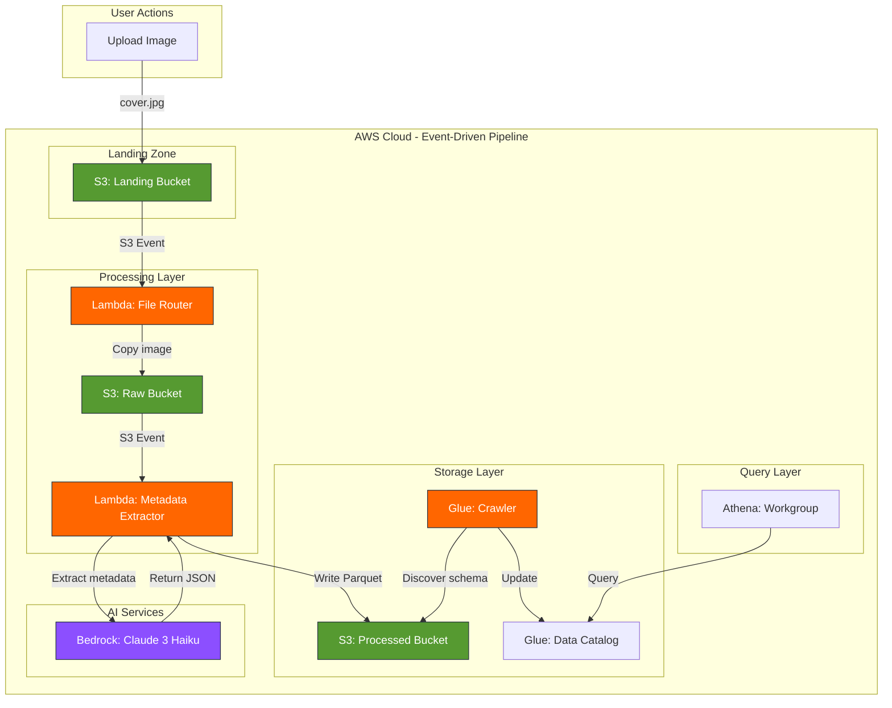

<!-- Improved compatibility of back to top link -->
<a id="readme-top"></a>

<!-- PROJECT SHIELDS -->
[![CI Status][ci-shield]][ci-url]
[![Issues][issues-shield]][issues-url]
[![MIT License][license-shield]][license-url]
[![LinkedIn][linkedin-shield]][linkedin-url]

<!-- PROJECT LOGO -->
<br />
<div align="center">
  <h1>📚</h1>

  <h3 align="center">Bookshelf Demo</h3>

  <p align="center">
    A cloud-native, event-driven ETL pipeline for extracting book metadata from images using AWS Bedrock!
    <br />
    <a href="https://github.com/sudoblark/sudoblark.ai.bookshelf-demo"><strong>Explore the docs »</strong></a>
    <br />
    <br />
    <a href="https://github.com/sudoblark/sudoblark.ai.bookshelf-demo">View Demo</a>
    ·
    <a href="https://github.com/sudoblark/sudoblark.ai.bookshelf-demo/issues/new?labels=bug&template=bug-report---.md">Report Bug</a>
    ·
    <a href="https://github.com/sudoblark/sudoblark.ai.bookshelf-demo/issues/new?labels=enhancement&template=feature-request---.md">Request Feature</a>
  </p>
</div>

<!-- TABLE OF CONTENTS -->
<details>
  <summary>Table of Contents</summary>
  <ol>
    <li>
      <a href="#about-the-project">About The Project</a>
      <ul>
        <li><a href="#built-with">Built With</a></li>
      </ul>
    </li>
    <li>
      <a href="#architecture">Architecture</a>
      <ul>
        <li><a href="#data-driven-infrastructure-pattern">Data-Driven Infrastructure Pattern</a></li>
        <li><a href="#etl-pipeline-flow">ETL Pipeline Flow</a></li>
        <li><a href="#metadata-schema">Metadata Schema</a></li>
      </ul>
    </li>
    <li>
      <a href="#getting-started">Getting Started</a>
      <ul>
        <li><a href="#prerequisites">Prerequisites</a></li>
        <li><a href="#installation">Installation</a></li>
      </ul>
    </li>
    <li><a href="#usage">Usage</a></li>
    <li><a href="#testing">Testing</a></li>
    <li><a href="#deployment">Deployment</a></li>
    <li><a href="#troubleshooting">Troubleshooting</a></li>
    <li><a href="#license">License</a></li>
    <li><a href="#contact">Contact</a></li>
    <li><a href="#acknowledgments">Acknowledgments</a></li>
  </ol>
</details>

<!-- ABOUT THE PROJECT -->
## About The Project

> **📢 Workshop Demo Repository**
>
> This project is designed as a **hands-on workshop demonstration** for learning modern AWS serverless patterns and AI integration.
> Whether you're attending a live workshop or exploring on your own, this repo provides a complete, fully-functional example you can deploy and experiment with.

> **⚠️ Infrastructure Configuration**
>
> This repository is pre-configured to deploy to **Sudoblark's AWS infrastructure**. If you want to deploy to your own AWS account, you'll need to modify the Terraform configuration files to match your environment (account names, bucket names, state backend, etc.).

The Bookshelf Demo showcases a serverless ETL pipeline built entirely on AWS. Upload a single book cover image, and watch as AI automatically extracts metadata, structures it in Parquet format, and makes it queryable via SQL.

**What You'll Learn:**

| Topic | What the demo teaches |
|---|---|
| **Event-Driven Pipeline Design** | How to build fully decoupled processing stages where each component communicates only via storage events — no direct service-to-service calls, no orchestration layer |
| **Cloud-Portable Patterns** | The underlying pattern (object storage event → serverless compute → object storage) maps cleanly across clouds — see table below |
| **AI/ML Integration** | How to wire a foundation model into a serverless pipeline for practical vision tasks, and where the equivalent service sits on other clouds |
| **Infrastructure as Code** | Data-driven Terraform patterns that keep resource definitions as simple data structures — easy to replicate, extend, or port |
| **Production Engineering** | OOP handlers with shared code modules, automated testing (pytest + moto), CI/CD, and security scanning |

**Cloud equivalence — the same pattern, different providers:**

| Concept | AWS (this demo) | GCP | Azure |
|---|---|---|---|
| Object storage | S3 | Cloud Storage | Blob Storage |
| Storage events | S3 Event Notifications | Eventarc / Pub/Sub | Event Grid |
| Serverless compute | Lambda | Cloud Functions | Azure Functions |
| Managed AI model | Bedrock (Claude 3 Haiku) | Vertex AI | Azure OpenAI |
| Columnar query engine | Athena | BigQuery | Synapse Analytics |
| Schema discovery | Glue Crawler | Dataplex / BigQuery auto-detect | Purview |
| IaC | Terraform | Terraform | Terraform |

**Perfect for:** Software engineers and cloud architects who want to understand event-driven pipeline design as a reusable pattern, demonstrated end-to-end on AWS.

<p align="right">(<a href="#readme-top">back to top</a>)</p>

### Built With

* [![Python][Python-badge]][Python-url]
* [![AWS][AWS-badge]][AWS-url]
* [![Terraform][Terraform-badge]][Terraform-url]
* [![GitHub Actions][GitHub-Actions-badge]][GitHub-Actions-url]

<p align="right">(<a href="#readme-top">back to top</a>)</p>


<!-- ARCHITECTURE -->
## Architecture

The system uses an **event-driven, serverless ETL pipeline**:



<p align="right">(<a href="#readme-top">back to top</a>)</p>

### Data-Driven Infrastructure Pattern

This project demonstrates Sudoblark's **three-layer Terraform architecture**:

1. **Data Layer** (`modules/data/`): Infrastructure defined as simple data structures
2. **Infrastructure Modules**: Reusable Terraform modules (referenced from external repositories)
3. **Instantiation Layer** (`infrastructure/aws-sudoblark-development/`): Wires data to modules

**Benefits:**
- Add new resources by updating data structures, not writing Terraform
- Consistent naming and tagging across all resources
- Cross-reference resolution handled automatically
- Easy to test and validate before deployment

<p align="right">(<a href="#readme-top">back to top</a>)</p>

### ETL Pipeline Flow

**Step-by-step processing:**

1. **Upload**: User uploads a single image to `landing/uploads/{user_id}/{upload_id}/` in the Landing bucket
2. **Route**: S3 event triggers File Router Lambda → copies image to Raw bucket
3. **Analyze**: S3 event triggers Metadata Extractor Lambda for each image
4. **AI Processing**: Lambda sends image to Bedrock Claude 3 Haiku with vision prompt
5. **Store**: Lambda writes extracted metadata as Parquet to Processed bucket
6. **Catalog**: Glue Crawler (scheduled daily) discovers schema
7. **Query**: Users query metadata via Athena SQL

**Processing Time:**
- File routing: ~1-2 seconds per image
- Metadata extraction: ~3-8 seconds per image (Bedrock API call)
- Glue crawl: ~30-60 seconds (scheduled, not blocking)

<p align="right">(<a href="#readme-top">back to top</a>)</p>

### Metadata Schema

Extracted metadata is defined as the [`BookMetadata`](lambda-packages/metadata-extractor/models.py) Pydantic model in `lambda-packages/metadata-extractor/models.py`. That file is the single source of truth for field names, types, validation rules, and defaults — refer to it directly rather than any secondary table.

Each processed record also includes `id` (UUID), `filename`, and `processed_at` (ISO 8601 timestamp) added by the processor at write time.
## Getting Started

To get a local copy up and running follow these simple steps.

### Prerequisites

**Important Constraints:**
- ⚠️ **AWS Costs**: Running this infrastructure will incur AWS charges (Lambda, S3, Glue, Athena, Bedrock API calls)
- 🌍 **Region Lock**: Infrastructure must deploy to `eu-west-2` (London) due to Bedrock model availability
- 🏗️ **Demo Code**: This is workshop/learning code - not production-hardened (limited error handling, no alerting)
- 📦 **Manual Packaging**: Lambda functions must be packaged locally before Terraform deployment
- 🗑️ **Force Destroy**: All S3 buckets and Athena workgroups are configured with `force_destroy = true` — running the destroy pipeline will permanently delete all bucket contents and query history without confirmation. This is intentional for a demo environment but should never be used in production.

**Required Tools & Access:**

* **AWS Account** with Bedrock access enabled in eu-west-2
  ```sh
  # Verify AWS CLI configured
  aws sts get-caller-identity
  ```

* **Terraform** 1.6+ (check `.terraform-version` file)
  ```sh
  terraform --version
  ```

* **Python** 3.11+
  ```sh
  python --version  # Should be 3.11 or higher
  ```

* **AWS Bedrock Model Access** - Claude 3 Haiku must be enabled:
  - Model ID: `anthropic.claude-3-haiku-20240307-v1:0`
  - Region: `eu-west-2` (London)
  - Access: Enable in AWS Bedrock console

<p align="right">(<a href="#readme-top">back to top</a>)</p>

### Installation

**Step 1: Clone the repository**

```sh
git clone https://github.com/sudoblark/sudoblark.ai.bookshelf-demo.git
cd sudoblark.ai.bookshelf-demo
```

**Step 2: Set up Python environment**

```sh
# Create virtual environment
python -m venv .venv
source .venv/bin/activate  # On Windows: .venv\Scripts\activate

# Install development dependencies
pip install -r requirements-dev.txt

# Install pre-commit hooks (highly recommended)
pre-commit install

# Install Lambda dependencies for local testing
cd lambda-packages/common
pip install -r requirements.txt -r requirements-ci.txt
cd ../file-router
pip install -r requirements.txt -r requirements-ci.txt
cd ../metadata-extractor
pip install -r requirements.txt -r requirements-ci.txt
cd ../..
```

> **💡 Pre-commit hooks:** Automatically run code formatters and linters before each commit. This catches issues early before CI/CD.
>
> Run manually: `pre-commit run --all-files`

**Step 3: Package Lambda functions**

```sh
bash scripts/bundle-lambdas.sh
```

> **💡 Lambda Packaging:** The bundle script packages each Lambda and automatically copies `lambda-packages/common/` into every ZIP so shared utilities are importable at runtime. `requirements.txt` contains minimal runtime dependencies for deployment; `requirements-ci.txt` contains additional dependencies (boto3, pandas, pyarrow) needed for local testing/CI that are provided by Lambda runtime or AWS layers in production.
```sh
cd infrastructure/aws-sudoblark-development
terraform init
terraform plan  # Review changes
terraform apply  # Type 'yes' to confirm
```

**Expected resources created:**
- 3 S3 buckets (landing, raw, processed)
- 2 Lambda functions (file-router, metadata-extractor)
- 2 IAM roles with appropriate permissions
- 3 S3 event notifications (one per supported image extension on the landing bucket)
- 1 Glue database
- 1 Glue crawler (scheduled daily at 02:00 UTC)
- 1 Athena workgroup

<p align="right">(<a href="#readme-top">back to top</a>)</p>

<!-- USAGE EXAMPLES -->
## Usage

### Basic Workflow

1. **Prepare a book cover image**
   ```sh
   # Navigate to demo images directory
   cd data/demo-images

   # Download sample book covers (optional - skip if images already exist)
   # This downloads ~400-600 book covers from Open Library
   ./download_covers.sh
   ```

2. **Upload a single image to S3 Landing bucket**
   ```sh
   LANDING_BUCKET=$(aws s3 ls | grep landing | awk '{print $3}')
   # Key format: uploads/{user_id}/{upload_id}/{filename}
   aws s3 cp cover.jpg s3://${LANDING_BUCKET}/uploads/default/demo-upload/cover.jpg
   ```

3. **Monitor processing** (optional)
   ```sh
   # Watch CloudWatch logs for file-router
   aws logs tail /aws/lambda/aws-sudoblark-development-bookshelf-demo-file-router --follow

   # Watch metadata-extractor logs
   aws logs tail /aws/lambda/aws-sudoblark-development-bookshelf-demo-metadata-extractor --follow
   ```

4. **Run Glue Crawler** (or wait for daily schedule)
   ```sh
   aws glue start-crawler --name aws-sudoblark-development-bookshelf-demo-bookshelf-metadata-crawler
   ```

5. **Query with Athena**
   ```sql
   -- View all extracted book metadata
   SELECT *
   FROM "aws-sudoblark-development-bookshelf-demo-bookshelf"."processed"
   LIMIT 10;

   -- Find books by author
   SELECT title, author, published_year
   FROM "aws-sudoblark-development-bookshelf-demo-bookshelf"."processed"
   WHERE author LIKE '%George%'
   ORDER BY published_year DESC;

   -- Count books by publisher
   SELECT publisher, COUNT(*) as book_count
   FROM "aws-sudoblark-development-bookshelf-demo-bookshelf"."processed"
   GROUP BY publisher
   ORDER BY book_count DESC;
   ```

<p align="right">(<a href="#readme-top">back to top</a>)</p>

### Advanced Examples

**Group books by author:**
```sql
SELECT
    author,
    COUNT(*) as book_count,
    MIN(published_year) as earliest_publication,
    MAX(published_year) as latest_publication,
    ROUND(AVG(confidence), 2) as avg_confidence
FROM "aws-sudoblark-development-bookshelf-demo-bookshelf"."processed"
WHERE author IS NOT NULL AND author != ''
GROUP BY author
ORDER BY book_count DESC, author ASC;
```

**Group books by publication year:**
```sql
SELECT
    published_year,
    COUNT(*) as book_count,
    COUNT(DISTINCT author) as unique_authors,
    COUNT(DISTINCT publisher) as unique_publishers,
    ROUND(AVG(confidence), 2) as avg_confidence
FROM "aws-sudoblark-development-bookshelf-demo-bookshelf"."processed"
WHERE published_year IS NOT NULL
GROUP BY published_year
ORDER BY published_year DESC;
```

**Data quality metrics:**
```sql
WITH base_stats AS (
    SELECT
        COUNT(*) as total_rows,
        COUNT(DISTINCT id) as unique_ids,
        COUNT(DISTINCT LOWER(TRIM(title || '|' || author))) as unique_books
    FROM "aws-sudoblark-development-bookshelf-demo-bookshelf"."processed"
),
field_stats AS (
    SELECT
        -- Title analysis
        COUNT(CASE WHEN title IS NOT NULL AND title != '' THEN 1 END) as titles_present,
        COUNT(CASE WHEN title IS NULL OR title = '' THEN 1 END) as titles_missing,

        -- Author analysis
        COUNT(CASE WHEN author IS NOT NULL AND author != '' THEN 1 END) as authors_present,
        COUNT(CASE WHEN author IS NULL OR author = '' THEN 1 END) as authors_missing,

        -- ISBN analysis
        COUNT(CASE WHEN isbn IS NOT NULL AND isbn != '' THEN 1 END) as isbns_present,
        COUNT(CASE WHEN isbn IS NULL OR isbn = '' THEN 1 END) as isbns_missing,

        -- Publisher analysis
        COUNT(CASE WHEN publisher IS NOT NULL AND publisher != '' THEN 1 END) as publishers_present,
        COUNT(CASE WHEN publisher IS NULL OR publisher = '' THEN 1 END) as publishers_missing,

        -- Year analysis
        COUNT(CASE WHEN published_year IS NOT NULL THEN 1 END) as years_present,
        COUNT(CASE WHEN published_year IS NULL THEN 1 END) as years_missing,

        -- Description analysis
        COUNT(CASE WHEN description IS NOT NULL AND description != '' THEN 1 END) as descriptions_present,
        COUNT(CASE WHEN description IS NULL OR description = '' THEN 1 END) as descriptions_missing,

        -- Confidence analysis
        ROUND(AVG(confidence), 3) as avg_confidence,
        ROUND(MIN(confidence), 3) as min_confidence,
        ROUND(MAX(confidence), 3) as max_confidence,
        COUNT(CASE WHEN confidence < 0.7 THEN 1 END) as low_confidence_count,

        -- Completeness score (books with all core fields)
        COUNT(CASE
            WHEN title IS NOT NULL AND title != ''
            AND author IS NOT NULL AND author != ''
            AND published_year IS NOT NULL
            THEN 1
        END) as complete_records
    FROM "aws-sudoblark-development-bookshelf-demo-bookshelf"."processed"
)
SELECT
    b.total_rows,
    b.unique_ids,
    b.total_rows - b.unique_ids as duplicate_ids,
    b.unique_books,
    b.total_rows - b.unique_books as duplicate_books,

    f.titles_present,
    f.titles_missing,
    ROUND(CAST(f.titles_present AS DOUBLE) / b.total_rows * 100, 1) as title_completeness_pct,

    f.authors_present,
    f.authors_missing,
    ROUND(CAST(f.authors_present AS DOUBLE) / b.total_rows * 100, 1) as author_completeness_pct,

    f.isbns_present,
    f.isbns_missing,
    ROUND(CAST(f.isbns_present AS DOUBLE) / b.total_rows * 100, 1) as isbn_completeness_pct,

    f.publishers_present,
    f.publishers_missing,

    f.years_present,
    f.years_missing,

    f.descriptions_present,
    f.descriptions_missing,

    f.avg_confidence,
    f.min_confidence,
    f.max_confidence,
    f.low_confidence_count,

    f.complete_records,
    ROUND(CAST(f.complete_records AS DOUBLE) / b.total_rows * 100, 1) as complete_records_pct
FROM base_stats b, field_stats f;
```

<p align="right">(<a href="#readme-top">back to top</a>)</p>

<!-- TESTING -->
## Testing

This project follows Sudoblark's Python quality standards with comprehensive test coverage.

### Running Tests

```sh
# Run all tests with coverage
pytest --cov=lambda-packages --cov-report=html --cov-report=term-missing

# Run specific test file
pytest tests/test_metadata_extractor.py -v

# Run with mocked AWS services
pytest tests/test_file_router.py -v
```

### Test Coverage Requirements

- **Minimum Coverage:** 80%
- **Current Coverage:** Check CI/CD badge at top of README
- **Coverage Report:** Generated in `htmlcov/index.html` after running tests

### Test Structure

```
tests/
├── conftest.py                   # Pytest fixtures and configuration
├── test_common.py                # Tests for shared common utilities
├── test_file_router.py           # Tests for image routing Lambda
└── test_metadata_extractor.py    # Tests for Bedrock metadata extraction
```

### Linting and Security

```sh
# Format code with Black
black lambda-packages/ tests/

# Sort imports
isort lambda-packages/ tests/

# Lint with Flake8
flake8 lambda-packages/ tests/

# Type checking with mypy (requires boto3-stubs)
pip install 'boto3-stubs[s3,bedrock-runtime]'
mypy lambda-packages/

# Security scan with Bandit
bandit -r lambda-packages/
```

**CI/CD:** All checks run automatically on pull requests. See `.github/workflows/pull-request.yaml`.

<p align="right">(<a href="#readme-top">back to top</a>)</p>

<!-- DEPLOYMENT -->
## Deployment

### CI/CD Pipeline

This project uses **GitHub Actions** for continuous integration and deployment:

**Pull Request Workflow** (`.github/workflows/pull-request.yaml`):
- Python linting (Black, isort, Flake8)
- Security scanning (Bandit)
- Unit tests with coverage reporting
- Terraform validation and plan

**Manual Deployment Workflows**:
- `apply.yaml` - Deploy infrastructure to AWS
- `destroy.yaml` - Tear down infrastructure (use with caution)

### Deployment Environments

| Environment | AWS Account | Region | Purpose |
|-------------|-------------|--------|---------|
| Development | sudoblark-development | eu-west-2 | Testing and experimentation |

### Manual Deployment

```sh
# Navigate to infrastructure directory
cd infrastructure/aws-sudoblark-development

# Initialize Terraform (first time only)
terraform init

# Review changes
terraform plan -out=tfplan

# Apply changes
terraform apply tfplan

# Destroy infrastructure (when no longer needed)
terraform destroy
```

### Deployment Verification

```sh
# Verify S3 buckets created
aws s3 ls | grep bookshelf-demo

# Verify Lambda functions deployed
aws lambda list-functions \
  --query 'Functions[?contains(FunctionName, `bookshelf-demo`)].FunctionName'

# Verify Glue resources
aws glue get-database --name aws-sudoblark-development-bookshelf-demo-bookshelf
aws glue get-crawler --name aws-sudoblark-development-bookshelf-demo-bookshelf-crawler

# Test Lambda invocation
aws lambda invoke \
  --function-name aws-sudoblark-development-bookshelf-demo-file-router \
  --payload '{}' \
  response.json
```

<p align="right">(<a href="#readme-top">back to top</a>)</p>

<!-- TROUBLESHOOTING -->
## Troubleshooting

### Common Issues

**Issue: "Bedrock model not accessible"**
```
Error: An error occurred (ResourceNotFoundException) when calling the InvokeModel operation
```
**Solution:** Ensure Claude 3 Haiku is enabled in AWS Bedrock console (eu-west-2 region).

**Issue: "Lambda timeout"**
```
Task timed out after 60.00 seconds
```
**Solution:** Bedrock API calls may occasionally be slow. Increase the `metadata-extractor` Lambda timeout in `modules/data/lambdas.tf`.

**Issue: "Glue Crawler not finding data"**
```
No tables found in database
```
**Solution:**
1. Verify Parquet files exist in processed bucket: `aws s3 ls s3://BUCKET-NAME/processed/`
2. Manually trigger crawler: `aws glue start-crawler --name CRAWLER-NAME`
3. Check crawler logs in CloudWatch

**Issue: "Module not found in Lambda"**
```
ModuleNotFoundError: No module named 'PIL'
```
**Solution:** Re-package Lambda with dependencies:
```sh
cd lambda-packages/metadata-extractor
rm -rf *  # Clean directory
cp path/to/your/handler.py .
pip install -r requirements.txt -t .
zip -r ../../metadata-extractor.zip .
```

**Issue: "Terraform state locked"**
```
Error: Error acquiring the state lock
```
**Solution:** Someone else is running Terraform, or previous run didn't complete. Wait or force unlock (dangerous):
```sh
terraform force-unlock LOCK_ID
```

### Debugging Tips

**View Lambda logs:**
```sh
# Tail logs in real-time
aws logs tail /aws/lambda/FUNCTION-NAME --follow

# View recent logs
aws logs filter-log-events \
  --log-group-name /aws/lambda/FUNCTION-NAME \
  --start-time $(date -u -d '10 minutes ago' +%s)000
```

**Test Lambda locally:**
```sh
# Activate venv
source .venv/bin/activate

# Set environment variables
export RAW_BUCKET=raw
export LOG_LEVEL=DEBUG

# Run unit tests
python -m pytest tests/test_file_router.py -v
```

**Check S3 event notifications:**
```sh
aws s3api get-bucket-notification-configuration \
  --bucket BUCKET-NAME
```

<p align="right">(<a href="#readme-top">back to top</a>)</p>

<!-- LICENSE -->
## License

Distributed under the MIT License. See `LICENSE.txt` for more information.

<p align="right">(<a href="#readme-top">back to top</a>)</p>

<!-- CONTACT -->
## Contact

**Sudoblark Ltd** - Enterprise AI & Cloud Solutions

- 🌐 Website: [sudoblark.com](https://sudoblark.com)
- 💼 LinkedIn: [Sudoblark](https://linkedin.com/company/sudoblark)
- 📧 Email: [hello@sudoblark.com](mailto:hello@sudoblark.com)
- 🐙 GitHub: [@sudoblark](https://github.com/sudoblark)

**Project Link:** [https://github.com/sudoblark/sudoblark.ai.bookshelf-demo](https://github.com/sudoblark/sudoblark.ai.bookshelf-demo)

<p align="right">(<a href="#readme-top">back to top</a>)</p>

<!-- ACKNOWLEDGMENTS -->
## Acknowledgments

This project was built using industry-leading tools and services:

* [AWS Bedrock](https://aws.amazon.com/bedrock/) - Claude 3 Haiku foundation model
* [Terraform](https://www.terraform.io/) - Infrastructure as Code
* [GitHub Actions](https://github.com/features/actions) - CI/CD automation
* [pytest](https://pytest.org/) - Python testing framework
* [Best-README-Template](https://github.com/othneildrew/Best-README-Template) - README structure
* [Shields.io](https://shields.io/) - README badges

**Architecture Patterns:**
This project demonstrates Sudoblark's professional development practices including data-driven infrastructure patterns, comprehensive testing, and modern DevOps workflows.

<p align="right">(<a href="#readme-top">back to top</a>)</p>

<!-- MARKDOWN LINKS & IMAGES -->
[contributors-shield]: https://img.shields.io/github/contributors/sudoblark/sudoblark.ai.bookshelf-demo.svg?style=for-the-badge
[contributors-url]: https://github.com/sudoblark/sudoblark.ai.bookshelf-demo/graphs/contributors
[forks-shield]: https://img.shields.io/github/forks/sudoblark/sudoblark.ai.bookshelf-demo.svg?style=for-the-badge
[forks-url]: https://github.com/sudoblark/sudoblark.ai.bookshelf-demo/network/members
[stars-shield]: https://img.shields.io/github/stars/sudoblark/sudoblark.ai.bookshelf-demo.svg?style=for-the-badge
[stars-url]: https://github.com/sudoblark/sudoblark.ai.bookshelf-demo/stargazers
[issues-shield]: https://img.shields.io/github/issues/sudoblark/sudoblark.ai.bookshelf-demo.svg?style=for-the-badge
[issues-url]: https://github.com/sudoblark/sudoblark.ai.bookshelf-demo/issues
[license-shield]: https://img.shields.io/github/license/sudoblark/sudoblark.ai.bookshelf-demo.svg?style=for-the-badge
[license-url]: https://github.com/sudoblark/sudoblark.ai.bookshelf-demo/blob/main/LICENSE.txt
[linkedin-shield]: https://img.shields.io/badge/-LinkedIn-black.svg?style=for-the-badge&logo=linkedin&colorB=555
[linkedin-url]: https://linkedin.com/company/sudoblark
[product-screenshot]: images/screenshot.png

<!-- Technology Badges -->
[Python-badge]: https://img.shields.io/badge/Python-3776AB?style=for-the-badge&logo=python&logoColor=white
[Python-url]: https://www.python.org/
[AWS-badge]: https://img.shields.io/badge/AWS-232F3E?style=for-the-badge&logo=amazon-aws&logoColor=white
[AWS-url]: https://aws.amazon.com/
[Terraform-badge]: https://img.shields.io/badge/Terraform-7B42BC?style=for-the-badge&logo=terraform&logoColor=white
[Terraform-url]: https://www.terraform.io/
[GitHub-Actions-badge]: https://img.shields.io/badge/GitHub_Actions-2088FF?style=for-the-badge&logo=github-actions&logoColor=white
[GitHub-Actions-url]: https://github.com/features/actions
[Bedrock-badge]: https://img.shields.io/badge/AWS_Bedrock-FF9900?style=for-the-badge&logo=amazon-aws&logoColor=white
[Bedrock-url]: https://aws.amazon.com/bedrock/
[Lambda-badge]: https://img.shields.io/badge/AWS_Lambda-FF9900?style=for-the-badge&logo=aws-lambda&logoColor=white
[Lambda-url]: https://aws.amazon.com/lambda/
[S3-badge]: https://img.shields.io/badge/AWS_S3-569A31?style=for-the-badge&logo=amazon-s3&logoColor=white
[S3-url]: https://aws.amazon.com/s3/
[Athena-badge]: https://img.shields.io/badge/AWS_Athena-232F3E?style=for-the-badge&logo=amazon-aws&logoColor=white
[Athena-url]: https://aws.amazon.com/athena/
[Glue-badge]: https://img.shields.io/badge/AWS_Glue-FF9900?style=for-the-badge&logo=amazon-aws&logoColor=white
[Glue-url]: https://aws.amazon.com/glue/
[ci-shield]: https://github.com/sudoblark/sudoblark.ai.bookshelf-demo/actions/workflows/pull-request.yaml/badge.svg?style=for-the-badge
[ci-url]: https://github.com/sudoblark/sudoblark.ai.bookshelf-demo/actions/workflows/pull-request.yaml
