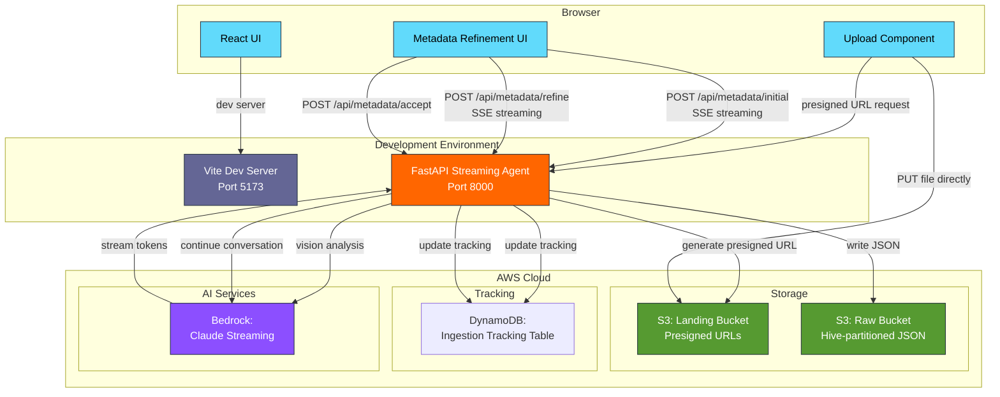

<!-- Improved compatibility of back to top link -->
<a id="readme-top"></a>

<!-- PROJECT SHIELDS -->
[![CI Status][ci-shield]][ci-url]
[![Issues][issues-shield]][issues-url]
[![MIT License][license-shield]][license-url]
[![LinkedIn][linkedin-shield]][linkedin-url]

<!-- PROJECT LOGO -->
<br />
<div align="center">
  <h1>📚</h1>

  <h3 align="center">Bookshelf Demo</h3>

  <p align="center">
    A cloud-native, event-driven ETL pipeline for extracting book metadata from images using AWS Bedrock!
    <br />
    <a href="https://github.com/sudoblark/sudoblark.ai.bookshelf-demo"><strong>Explore the docs »</strong></a>
    <br />
    <br />
    <a href="https://github.com/sudoblark/sudoblark.ai.bookshelf-demo">View Demo</a>
    ·
    <a href="https://github.com/sudoblark/sudoblark.ai.bookshelf-demo/issues/new?labels=bug&template=bug-report---.md">Report Bug</a>
    ·
    <a href="https://github.com/sudoblark/sudoblark.ai.bookshelf-demo/issues/new?labels=enhancement&template=feature-request---.md">Request Feature</a>
  </p>
</div>

<!-- TABLE OF CONTENTS -->
<details>
  <summary>Table of Contents</summary>
  <ol>
    <li>
      <a href="#about-the-project">About The Project</a>
      <ul>
        <li><a href="#repository-structure-mono-repo-vs-micro-repos">Repository Structure: Mono-repo vs Micro-repos</a></li>
        <li><a href="#built-with">Built With</a></li>
      </ul>
    </li>
    <li>
      <a href="#architecture">Architecture</a>
      <ul>
        <li><a href="#data-driven-infrastructure-pattern">Data-Driven Infrastructure Pattern</a></li>
        <li><a href="#etl-pipeline-flow">ETL Pipeline Flow</a></li>
        <li><a href="#metadata-schema">Metadata Schema</a></li>
      </ul>
    </li>
    <li><a href="#getting-started">Getting Started</a></li>
    <li><a href="#testing">Testing</a></li>
    <li><a href="#deployment">Deployment</a></li>
    <li><a href="#current-limitations">Current Limitations</a></li>
    <li><a href="#license">License</a></li>
    <li><a href="#contact">Contact</a></li>
    <li><a href="#acknowledgments">Acknowledgments</a></li>
  </ol>
</details>

<!-- ABOUT THE PROJECT -->
## About The Project

> **📢 Workshop Demo Repository**
>
> This project is designed as a **hands-on workshop demonstration** for learning modern AWS serverless patterns and AI integration.
> Whether you're attending a live workshop or exploring on your own, this repo provides a complete, fully-functional example you can deploy and experiment with.

> **⚠️ Infrastructure Configuration**
>
> This repository is pre-configured to deploy to **Sudoblark's AWS infrastructure**. If you want to deploy to your own AWS account, you'll need to modify the Terraform configuration files to match your environment (account names, bucket names, state backend, etc.).

The Bookshelf Demo showcases a complete, full-stack application for extracting book metadata from images using AWS and AI. Upload a book cover via the web interface, refine the extracted metadata through a conversational loop, and save confirmed books to your collection.

**What You'll Learn:**

| Topic | What the demo teaches |
|---|---|
| **Streaming AI Integration** | How to build real-time user experiences with Server-Sent Events, pydantic-ai agent streaming, and stateful conversation sessions |
| **Presigned URLs & Browser Uploads** | Securely uploading files directly from the browser to S3 without routing through your API — reducing latency and costs |
| **Full-Stack Web Development** | React frontend with Vite, FastAPI backend with async handlers, and integrating managed AI services into a seamless UX |
| **Infrastructure as Code** | Data-driven Terraform patterns that keep resource definitions as simple data structures — easy to replicate, extend, or port |
| **Production Engineering** | Type-safe async handlers, comprehensive testing with pytest, CI/CD automation, and modern development workflows |

**Cloud equivalence — the same pattern, different providers:**

| Concept | AWS (this demo) | GCP | Azure |
|---|---|---|---|
| Object storage | S3 | Cloud Storage | Blob Storage |
| Container orchestration | ECS Fargate | Cloud Run | Container Instances |
| API Gateway | API Gateway | Cloud Endpoints | API Management |
| Managed AI model | Bedrock (Claude) | Vertex AI | Azure OpenAI |
| NoSQL database | DynamoDB | Firestore | Cosmos DB |
| IaC | Terraform | Terraform | Terraform |

**Perfect for:** Full-stack developers and cloud architects who want to understand modern AI-powered web applications with streaming interactions, demonstrated end-to-end on AWS.

<p align="right">(<a href="#readme-top">back to top</a>)</p>

### Repository Structure: Mono-repo vs Micro-repos

This repository is a **mono-repo for demo convenience**. In production, each application component would live in its own repository with its own CI pipeline and release cadence — so a hotfix to the API never requires redeploying the ETL pipeline, and a frontend release never blocks on backend changes.

In a micro-repo setup, the repository to functionality mapping would be as follows:

| Production repo | Maps to | Purpose |
|---|---|---|
| `bookshelf.backend.openapi-lambdas` | `modules/data/lambdas.tf` (future) | Static REST endpoints (presigned URLs, accept, bookshelf queries) via Lambda |
| `bookshelf.backend.streaming-container` | `application/backend/streaming-agent/` | Streaming metadata extraction service (ECS Fargate or container) |
| `bookshelf.backend.shared-components` | `application/backend/common/` | Shared utilities (BookshelfTracker, response helpers, etc.) as versioned PyPI package |
| `bookshelf.frontend.portal` | `application/frontend/` | React UI consuming the APIs |

**Note on Terraform:** The infrastructure in `modules/` and `infrastructure/` is intentionally left as a single coupled state in this demo. In production, each service would own its Terraform, but splitting state introduces cross-service references that add complexity without teaching value here.

**Production split rationale:** Static endpoints (presigned URL generation, accept confirmation) stay on Lambda for cost efficiency, whilst streaming metadata extraction requires a persistent container (ECS Fargate). Shared utilities are versioned and imported by both services.

> **💡 Why a mono-repo here?** A single clone, a single `terraform apply`, and a single test run is enough to get the full system running. That removes friction for a demo or workshop while keeping the component boundaries clear enough to reason about the production shape.

<p align="right">(<a href="#readme-top">back to top</a>)</p>

### Built With

* [![Python][Python-badge]][Python-url]
* [![AWS][AWS-badge]][AWS-url]
* [![Terraform][Terraform-badge]][Terraform-url]
* [![GitHub Actions][GitHub-Actions-badge]][GitHub-Actions-url]

<p align="right">(<a href="#readme-top">back to top</a>)</p>


<!-- ARCHITECTURE -->
## Architecture

The system uses a **streaming API architecture** with a React frontend and FastAPI backend:



<p align="right">(<a href="#readme-top">back to top</a>)</p>

### Data-Driven Infrastructure Pattern

This project demonstrates Sudoblark's **three-layer Terraform architecture**:

1. **Data Layer** (`modules/data/`): Infrastructure defined as simple data structures
2. **Infrastructure Modules**: Reusable Terraform modules (referenced from external repositories)
3. **Instantiation Layer** (`infrastructure/aws-sudoblark-development/`): Wires data to modules

**Benefits:**
- Add new resources by updating data structures, not writing Terraform
- Consistent naming and tagging across all resources
- Cross-reference resolution handled automatically
- Easy to test and validate before deployment

<p align="right">(<a href="#readme-top">back to top</a>)</p>

### Application Flow

**Step-by-step interaction:**

1. **Upload**: User selects book cover image in React UI and clicks upload
2. **Presigned URL**: Frontend requests presigned S3 PUT URL from backend
3. **Direct Upload**: Browser uploads file directly to S3 Landing bucket (no API gateway)
4. **Initial Analysis**: Frontend calls `POST /api/metadata/initial` with file location

   Backend pipeline:
   - OCR extraction via AWS Textract
   - ISBN regex matching from OCR text
   - ISBN metadata lookup (Google Books → Open Library fallback)
   - Agent categorizes extracted data + performs fallback title/author lookup if needed
   - Streams metadata updates as SSE

5. **Streaming Extraction**: Frontend receives metadata updates in real-time as Server-Sent Events (SSE)
6. **User Refinement**: User sees initial metadata and can ask follow-up questions (multi-turn)
7. **Refinement Stream**: Frontend calls `POST /api/metadata/refine` for each question
8. **Accept**: User confirms metadata by clicking "Accept"
9. **Persist**: Backend writes accepted metadata as JSON to Raw bucket with Hive-style partitioning
10. **Track**: Ingestion-tracking table updated with file status throughout

<p align="right">(<a href="#readme-top">back to top</a>)</p>

### API Endpoints

The streaming agent exposes the following HTTP endpoints:

| Endpoint | Method | Purpose | Response |
|---|---|---|---|
| `/health` | GET | Container health check | `{"status": "ok"}` |
| `/api/upload/presigned` | GET | Generate presigned S3 PUT URL | `{"url": "...", "session_id": "..."}` |
| `/api/metadata/initial` | POST | Extract metadata from uploaded image | Server-Sent Events (streaming tokens) |
| `/api/metadata/refine` | POST | Multi-turn refinement conversation | Server-Sent Events (streaming tokens) |
| `/api/metadata/accept` | POST | Save confirmed metadata to S3 | `{"status": "accepted", "saved_key": "...", "upload_id": "..."}` |
| `/api/ops/files` | GET | List all uploaded files with status | `{"files": [...], "count": N}` |
| `/api/ops/files/{file_id}` | GET | Get details for a single upload | `{"file": {...}}` |
| `/api/bookshelf/overview` | GET | Get bookshelf statistics | `{"total_books": N, "most_common_author": str, "most_common_author_count": N}` |
| `/api/bookshelf/catalogue` | GET | Get paginated list of books | `{"books": [...], "page": N, "page_size": N, "total_books": N, "total_pages": N}` |
| `/api/bookshelf/search` | GET | Search books by title or author | `{"books": [...], "total_results": N, "query": str, "field": str}` |

### Metadata Schema

Book metadata is extracted using the pydantic-ai streaming API with Claude as the foundation model. Each accepted record is written to S3 as JSON with Hive-style partitioning (`author={author}/published_year={year}/{uuid}.json`) along with metadata provenance fields (filename, upload_id, extraction timestamp).
## Getting Started

**⚠️ All setup, installation, and local development instructions are in [docs/demo-execution.md](docs/demo-execution.md)**

This includes:
- Prerequisites and tool verification
- Step-by-step installation and environment setup
- Credential export for AWS SSO
- Running backend and frontend locally
- 5 complete end-to-end test scenarios
- Debugging checklist and performance notes

Start there for hands-on guidance.

<p align="right">(<a href="#readme-top">back to top</a>)</p>

<!-- TESTING -->
## Testing

This project follows Sudoblark's Python quality standards with comprehensive test coverage.

### Running Tests

```sh
# Run all tests with coverage
pytest --cov=application/backend --cov-report=html --cov-report=term-missing

# Run specific test file
pytest tests/test_tracker.py -v

# Run with mocked AWS services
pytest tests/test_file_router.py -v
```

### Test Coverage Requirements

- **Minimum Coverage:** 80%
- **Current Coverage:** Check CI/CD badge at top of README
- **Coverage Report:** Generated in `htmlcov/index.html` after running tests

### Test Structure

```
tests/
├── conftest.py                   # Pytest fixtures and configuration
├── test_common.py                # Tests for shared common utilities
├── test_tracker.py               # Tests for ingestion tracking utility
└── test_ops.py                   # Tests for ops dashboard endpoints (in streaming API)
```

### Linting and Security

```sh
# Format code with Black
black application/backend/ tests/

# Sort imports
isort application/backend/ tests/

# Lint with Flake8
flake8 application/backend/ tests/

# Type checking with mypy (requires boto3-stubs)
pip install 'boto3-stubs[s3,bedrock-runtime]'
mypy application/backend/

# Security scan with Bandit
bandit -r application/backend/
```

**CI/CD:** All checks run automatically on pull requests. See `.github/workflows/pull-request.yaml`.

<p align="right">(<a href="#readme-top">back to top</a>)</p>

<!-- DEPLOYMENT -->
## Deployment

This project uses **GitHub Actions** for continuous integration and deployment:

**Pull Request Workflow** (`.github/workflows/pull-request.yaml`):
- Python linting (Black, isort, Flake8)
- Security scanning (Bandit)
- Unit tests with coverage reporting
- Terraform validation and plan

**Manual Deployment Workflows**:
- `apply.yaml` - Deploy infrastructure to AWS
- `destroy.yaml` - Tear down infrastructure (use with caution)

For manual deployment and verification steps, see [docs/demo-execution.md](docs/demo-execution.md).

<p align="right">(<a href="#readme-top">back to top</a>)</p>

## Current Limitations

This is a **workshop demo** showcasing real AWS patterns. The following features are either in progress or planned:

| Feature | Status | Notes |
|---|---|---|
| **Authentication / Authorization** | 🚫 Not started | All endpoints are public. Cognito integration planned. |
| **Metadata Extraction** | ✅ Complete | OCR via Textract, ISBN lookup via Google Books/Open Library, agent categorization, fallback enrichment. |
| **Bookshelf Display** | ✅ Complete | Overview stats, paginated grid, search by title/author. Uses S3 direct queries (production: migrate to DynamoDB per ADR-0001). |
| **Ops Dashboard** | ✅ Complete | Real-time tracking of upload pipeline stages, status visibility, error details. |
| **Ook Chat** | 🚧 Stub only | Frontend page exists, backend streaming not yet implemented. |
| **Embeddings & Similarity** | 🚫 Not started | Can compute book similarity via Bedrock Titan embeddings. |
| **Persistence across restarts** | ⚠️ Partial | Session state is in-process only; DynamoDB tracking persists. |
| **Production deployment** | 🚧 In progress | Terraform for ECS Fargate / App Runner not yet implemented. |

**What works:**
- ✅ File upload via presigned URLs (direct browser → S3)
- ✅ Streaming metadata extraction (OCR + ISBN lookup + agent categorization)
- ✅ Multi-turn conversation refinement (streaming tokens)
- ✅ Metadata acceptance and S3 storage (Hive-partitioned JSON)
- ✅ Ingestion tracking with audit trail (DynamoDB)
- ✅ Bookshelf display (overview, pagination, search)
- ✅ Ops dashboard with pipeline visibility
- ✅ Local development (docker-compose or uvicorn)

**Next priority features:**
1. Ook chat interface (full streaming chat implementation)
2. Cognito authentication and user scoping
3. Embeddings and similarity search
4. Production deployment infrastructure (ECS Fargate + ALB)

<p align="right">(<a href="#readme-top">back to top</a>)</p>

For troubleshooting, debugging tips, and common issues, see [docs/demo-execution.md](docs/demo-execution.md).

<!-- LICENSE -->
## License

Distributed under the MIT License. See `LICENSE.txt` for more information.

<p align="right">(<a href="#readme-top">back to top</a>)</p>

<!-- CONTACT -->
## Contact

**Sudoblark Ltd** - Enterprise AI & Cloud Solutions

- 🌐 Website: [sudoblark.com](https://sudoblark.com)
- 💼 LinkedIn: [Sudoblark](https://linkedin.com/company/sudoblark)
- 📧 Email: [hello@sudoblark.com](mailto:hello@sudoblark.com)
- 🐙 GitHub: [@sudoblark](https://github.com/sudoblark)

**Project Link:** [https://github.com/sudoblark/sudoblark.ai.bookshelf-demo](https://github.com/sudoblark/sudoblark.ai.bookshelf-demo)

<p align="right">(<a href="#readme-top">back to top</a>)</p>

<!-- ACKNOWLEDGMENTS -->
## Acknowledgments

This project was built using industry-leading tools and services:

* [AWS Bedrock](https://aws.amazon.com/bedrock/) - Claude foundation models
* [Terraform](https://www.terraform.io/) - Infrastructure as Code
* [GitHub Actions](https://github.com/features/actions) - CI/CD automation
* [pytest](https://pytest.org/) - Python testing framework
* [Best-README-Template](https://github.com/othneildrew/Best-README-Template) - README structure
* [Shields.io](https://shields.io/) - README badges

**Architecture Patterns:**
This project demonstrates Sudoblark's professional development practices including data-driven infrastructure patterns, comprehensive testing, and modern DevOps workflows.

<p align="right">(<a href="#readme-top">back to top</a>)</p>

<!-- MARKDOWN LINKS & IMAGES -->
[contributors-shield]: https://img.shields.io/github/contributors/sudoblark/sudoblark.ai.bookshelf-demo.svg?style=for-the-badge
[contributors-url]: https://github.com/sudoblark/sudoblark.ai.bookshelf-demo/graphs/contributors
[forks-shield]: https://img.shields.io/github/forks/sudoblark/sudoblark.ai.bookshelf-demo.svg?style=for-the-badge
[forks-url]: https://github.com/sudoblark/sudoblark.ai.bookshelf-demo/network/members
[stars-shield]: https://img.shields.io/github/stars/sudoblark/sudoblark.ai.bookshelf-demo.svg?style=for-the-badge
[stars-url]: https://github.com/sudoblark/sudoblark.ai.bookshelf-demo/stargazers
[issues-shield]: https://img.shields.io/github/issues/sudoblark/sudoblark.ai.bookshelf-demo.svg?style=for-the-badge
[issues-url]: https://github.com/sudoblark/sudoblark.ai.bookshelf-demo/issues
[license-shield]: https://img.shields.io/github/license/sudoblark/sudoblark.ai.bookshelf-demo.svg?style=for-the-badge
[license-url]: https://github.com/sudoblark/sudoblark.ai.bookshelf-demo/blob/main/LICENSE.txt
[linkedin-shield]: https://img.shields.io/badge/-LinkedIn-black.svg?style=for-the-badge&logo=linkedin&colorB=555
[linkedin-url]: https://linkedin.com/company/sudoblark
[product-screenshot]: images/screenshot.png

<!-- Technology Badges -->
[Python-badge]: https://img.shields.io/badge/Python-3776AB?style=for-the-badge&logo=python&logoColor=white
[Python-url]: https://www.python.org/
[AWS-badge]: https://img.shields.io/badge/AWS-232F3E?style=for-the-badge&logo=amazon-aws&logoColor=white
[AWS-url]: https://aws.amazon.com/
[Terraform-badge]: https://img.shields.io/badge/Terraform-7B42BC?style=for-the-badge&logo=terraform&logoColor=white
[Terraform-url]: https://www.terraform.io/
[GitHub-Actions-badge]: https://img.shields.io/badge/GitHub_Actions-2088FF?style=for-the-badge&logo=github-actions&logoColor=white
[GitHub-Actions-url]: https://github.com/features/actions
[Bedrock-badge]: https://img.shields.io/badge/AWS_Bedrock-FF9900?style=for-the-badge&logo=amazon-aws&logoColor=white
[Bedrock-url]: https://aws.amazon.com/bedrock/
[Lambda-badge]: https://img.shields.io/badge/AWS_Lambda-FF9900?style=for-the-badge&logo=aws-lambda&logoColor=white
[Lambda-url]: https://aws.amazon.com/lambda/
[S3-badge]: https://img.shields.io/badge/AWS_S3-569A31?style=for-the-badge&logo=amazon-s3&logoColor=white
[S3-url]: https://aws.amazon.com/s3/
[Athena-badge]: https://img.shields.io/badge/AWS_Athena-232F3E?style=for-the-badge&logo=amazon-aws&logoColor=white
[Athena-url]: https://aws.amazon.com/athena/
[Glue-badge]: https://img.shields.io/badge/AWS_Glue-FF9900?style=for-the-badge&logo=amazon-aws&logoColor=white
[Glue-url]: https://aws.amazon.com/glue/
[ci-shield]: https://github.com/sudoblark/sudoblark.ai.bookshelf-demo/actions/workflows/pull-request.yaml/badge.svg?style=for-the-badge
[ci-url]: https://github.com/sudoblark/sudoblark.ai.bookshelf-demo/actions/workflows/pull-request.yaml
