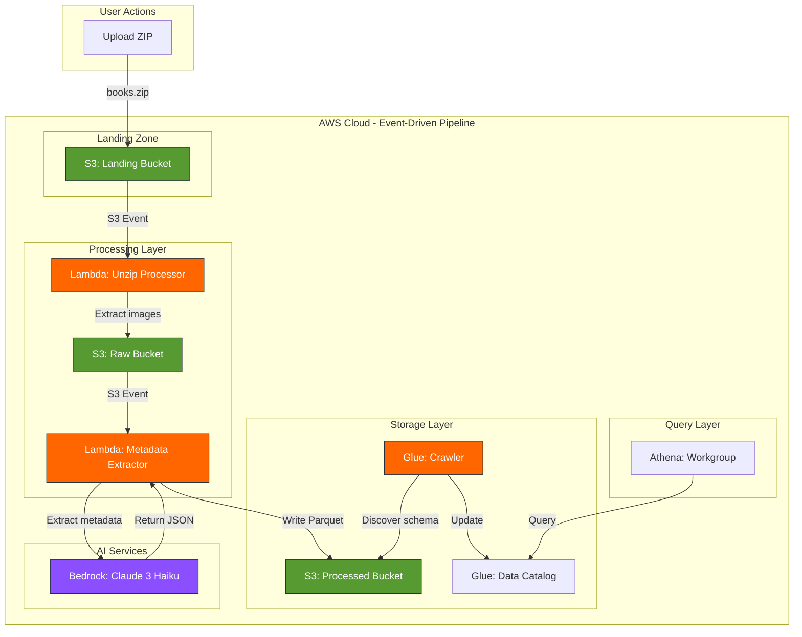

<!-- Improved compatibility of back to top link -->
<a id="readme-top"></a>

<!-- PROJECT SHIELDS -->
[![CI Status][ci-shield]][ci-url]
[![Issues][issues-shield]][issues-url]
[![MIT License][license-shield]][license-url]
[![LinkedIn][linkedin-shield]][linkedin-url]

<!-- PROJECT LOGO -->
<br />
<div align="center">
  <h1>📚</h1>

  <h3 align="center">Bookshelf Demo</h3>

  <p align="center">
    A cloud-native, event-driven ETL pipeline for extracting book metadata from images using AWS Bedrock!
    <br />
    <a href="https://github.com/sudoblark/sudoblark.ai.bookshelf-demo"><strong>Explore the docs »</strong></a>
    <br />
    <br />
    <a href="https://github.com/sudoblark/sudoblark.ai.bookshelf-demo">View Demo</a>
    ·
    <a href="https://github.com/sudoblark/sudoblark.ai.bookshelf-demo/issues/new?labels=bug&template=bug-report---.md">Report Bug</a>
    ·
    <a href="https://github.com/sudoblark/sudoblark.ai.bookshelf-demo/issues/new?labels=enhancement&template=feature-request---.md">Request Feature</a>
  </p>
</div>

<!-- TABLE OF CONTENTS -->
<details>
  <summary>Table of Contents</summary>
  <ol>
    <li>
      <a href="#about-the-project">About The Project</a>
      <ul>
        <li><a href="#built-with">Built With</a></li>
      </ul>
    </li>
    <li>
      <a href="#architecture">Architecture</a>
      <ul>
        <li><a href="#data-driven-infrastructure-pattern">Data-Driven Infrastructure Pattern</a></li>
        <li><a href="#etl-pipeline-flow">ETL Pipeline Flow</a></li>
        <li><a href="#metadata-schema">Metadata Schema</a></li>
      </ul>
    </li>
    <li>
      <a href="#getting-started">Getting Started</a>
      <ul>
        <li><a href="#prerequisites">Prerequisites</a></li>
        <li><a href="#installation">Installation</a></li>
      </ul>
    </li>
    <li><a href="#usage">Usage</a></li>
    <li><a href="#testing">Testing</a></li>
    <li><a href="#deployment">Deployment</a></li>
    <li><a href="#troubleshooting">Troubleshooting</a></li>
    <li><a href="#roadmap">Roadmap</a></li>
    <li><a href="#contributing">Contributing</a></li>
    <li><a href="#license">License</a></li>
    <li><a href="#contact">Contact</a></li>
    <li><a href="#acknowledgments">Acknowledgments</a></li>
  </ol>
</details>

<!-- ABOUT THE PROJECT -->
## About The Project

The Bookshelf Demo showcases a production-ready, serverless ETL pipeline built entirely on AWS. Upload a ZIP file containing book cover images, and watch as AI automatically extracts metadata, structures it in Parquet format, and makes it queryable via SQL.

Here's why this project is valuable:
* **Learn Modern AWS Patterns**: Demonstrates event-driven architecture, serverless computing, and data lake design
* **AI/ML Integration**: Shows practical AWS Bedrock integration for computer vision tasks
* **Infrastructure as Code**: Implements data-driven Terraform patterns used in enterprise environments
* **Production-Ready**: Includes testing, CI/CD, monitoring, and comprehensive documentation

This project is perfect for learning serverless ETL pipelines, AWS Bedrock integration, or data-driven infrastructure patterns.

<p align="right">(<a href="#readme-top">back to top</a>)</p>

### Built With

* [![Python][Python.org]][Python-url]
* [![AWS][AWS.com]][AWS-url]
* [![Terraform][Terraform.io]][Terraform-url]
* [![GitHub Actions][GitHub.com]][GitHub-url]

<p align="right">(<a href="#readme-top">back to top</a>)</p>


<!-- ARCHITECTURE -->
## Architecture

The system uses an **event-driven, serverless ETL pipeline**:



<p align="right">(<a href="#readme-top">back to top</a>)</p>

### Data-Driven Infrastructure Pattern

This project demonstrates Sudoblark's **three-layer Terraform architecture**:

1. **Data Layer** (`modules/data/`): Infrastructure defined as simple data structures
2. **Infrastructure Modules**: Reusable Terraform modules (referenced from external repositories)
3. **Instantiation Layer** (`infrastructure/aws-sudoblark-development/`): Wires data to modules

**Benefits:**
- Add new resources by updating data structures, not writing Terraform
- Consistent naming and tagging across all resources
- Cross-reference resolution handled automatically
- Easy to test and validate before deployment

See [Terraform Quality Standards](https://github.com/sudoblark/sudoblark.documentation/blob/main/quality-standards/terraform.md) for details.

<p align="right">(<a href="#readme-top">back to top</a>)</p>

### ETL Pipeline Flow

**Step-by-step processing:**

1. **Upload**: User uploads `books.zip` to Landing bucket
2. **Extract**: S3 event triggers Unzip Lambda → extracts images to Raw bucket
3. **Analyze**: S3 event triggers Metadata Extractor Lambda for each image
4. **AI Processing**: Lambda sends image to Bedrock Claude 3 Haiku with vision prompt
5. **Store**: Lambda writes extracted metadata as Parquet to Processed bucket
6. **Catalog**: Glue Crawler (scheduled daily) discovers schema
7. **Query**: Users query metadata via Athena SQL

**Processing Time:**
- Unzip: ~2-5 seconds for typical ZIP (10-50 images)
- Metadata extraction: ~3-8 seconds per image (Bedrock API call)
- Glue crawl: ~30-60 seconds (scheduled, not blocking)

<p align="right">(<a href="#readme-top">back to top</a>)</p>

### Metadata Schema

Extracted book metadata in Parquet format:

| Field | Type | Description | Example |
|-------|------|-------------|---------|
| `title` | string | Book title | "The Pragmatic Programmer" |
| `author` | string | Author name(s) | "Andrew Hunt, David Thomas" |
| `isbn` | string | ISBN-10 or ISBN-13 | "978-0135957059" |
| `publisher` | string | Publishing company | "Addison-Wesley" |
| `published_year` | integer | Year of publication | 2019 |
| `genre` | string | Book category | "Software Engineering" |
| `description` | string | Brief synopsis | "Your journey to mastery" |
| `image_name` | string | Original filename | "cover1.jpg" |
| `processing_timestamp` | timestamp | When processed | "2026-03-09T10:30:00Z" |
| `confidence` | float | Extraction confidence | 0.92 |

**Note**: Fields may be `null` if Bedrock cannot extract from image.

<p align="right">(<a href="#readme-top">back to top</a>)</p>

<!-- GETTING STARTED -->
## Getting Started

To get a local copy up and running follow these simple steps.

### Prerequisites

List of required tools and services:

* **AWS Account** with Bedrock access enabled in eu-west-2
  ```sh
  # Verify AWS CLI configured
  aws sts get-caller-identity
  ```

* **Terraform** 1.6+ (check `.terraform-version` file)
  ```sh
  terraform --version
  ```

* **Python** 3.11+
  ```sh
  python --version  # Should be 3.11 or higher
  ```

* **AWS Bedrock Model Access** - Claude 3 Haiku must be enabled:
  - Model ID: `anthropic.claude-3-haiku-20240307-v1:0`
  - Region: `eu-west-2` (London)
  - Access: Enable in AWS Bedrock console

<p align="right">(<a href="#readme-top">back to top</a>)</p>

### Installation

**Step 1: Clone the repository**

```sh
git clone https://github.com/sudoblark/sudoblark.ai.bookshelf-demo.git
cd sudoblark.ai.bookshelf-demo
```

**Step 2: Set up Python environment**

```sh
# Create virtual environment
python -m venv .venv
source .venv/bin/activate  # On Windows: .venv\Scripts\activate

# Install development dependencies
pip install -r requirements-dev.txt

# Install pre-commit hooks (highly recommended)
pre-commit install

# Install Lambda dependencies for local testing
cd lambda-packages/unzip-processor
pip install -r requirements.txt
cd ../metadata-extractor
pip install -r requirements.txt
cd ../..
```

> **💡 Pre-commit hooks:** Automatically run code formatters and linters before each commit. This catches issues early before CI/CD.
>
> Run manually: `pre-commit run --all-files`

**Step 3: Package Lambda functions**

```sh
# Unzip processor
cd lambda-packages/unzip-processor
pip install -r requirements.txt -t .
zip -r ../../unzip-processor.zip .
cd ../..

# Metadata extractor (includes Pillow for image handling)
cd lambda-packages/metadata-extractor
pip install -r requirements.txt -t .
zip -r ../../metadata-extractor.zip .
cd ../..
```

**Step 4: Deploy with Terraform**

```sh
cd infrastructure/aws-sudoblark-development
terraform init
terraform plan  # Review changes
terraform apply  # Type 'yes' to confirm
```

**Expected resources created:**
- 3 S3 buckets (landing, raw, processed)
- 2 Lambda functions (unzip-processor, metadata-extractor)
- 2 IAM roles with appropriate permissions
- 2 S3 event notifications
- 1 Glue database
- 1 Glue crawler (scheduled daily at 02:00 UTC)
- 1 Athena workgroup

<p align="right">(<a href="#readme-top">back to top</a>)</p>

<!-- USAGE EXAMPLES -->
## Usage

### Basic Workflow

1. **Prepare book cover images**
   ```sh
   # Create a directory with your book cover images
   mkdir book-covers
   cp /path/to/cover1.jpg book-covers/
   cp /path/to/cover2.jpg book-covers/
   ```

2. **Create ZIP file**
   ```sh
   cd book-covers
   zip -r ../books.zip *.jpg *.jpeg *.png
   cd ..
   ```

3. **Upload to S3 Landing bucket**
   ```sh
   LANDING_BUCKET=$(aws s3 ls | grep landing | awk '{print $3}')
   aws s3 cp books.zip s3://${LANDING_BUCKET}/books.zip
   ```

4. **Monitor processing** (optional)
   ```sh
   # Watch CloudWatch logs for unzip-processor
   aws logs tail /aws/lambda/aws-sudoblark-development-bookshelf-demo-unzip-processor --follow

   # Watch metadata-extractor logs
   aws logs tail /aws/lambda/aws-sudoblark-development-bookshelf-demo-metadata-extractor --follow
   ```

5. **Run Glue Crawler** (or wait for daily schedule)
   ```sh
   aws glue start-crawler --name aws-sudoblark-development-bookshelf-demo-bookshelf-crawler
   ```

6. **Query with Athena**
   ```sql
   -- View all extracted book metadata
   SELECT *
   FROM "aws-sudoblark-development-bookshelf-demo-bookshelf"."processed"
   ORDER BY processing_timestamp DESC;

   -- Find books by author
   SELECT title, author, published_year
   FROM "aws-sudoblark-development-bookshelf-demo-bookshelf"."processed"
   WHERE author LIKE '%Martin%'
   ORDER BY published_year DESC;

   -- Count books by genre
   SELECT genre, COUNT(*) as book_count
   FROM "aws-sudoblark-development-bookshelf-demo-bookshelf"."processed"
   GROUP BY genre
   ORDER BY book_count DESC;
   ```

<p align="right">(<a href="#readme-top">back to top</a>)</p>

### Advanced Examples

**Query books published after 2020:**
```sql
SELECT title, author, published_year, genre
FROM "aws-sudoblark-development-bookshelf-demo-bookshelf"."processed"
WHERE published_year > 2020
ORDER BY published_year DESC, title ASC;
```

**Find books with low confidence scores** (may need manual review):
```sql
SELECT title, author, confidence, image_name
FROM "aws-sudoblark-development-bookshelf-demo-bookshelf"."processed"
WHERE confidence < 0.7
ORDER BY confidence ASC;
```

**Export results to S3:**
```sql
-- Create a new table with query results
CREATE TABLE export_books_2020s AS
SELECT *
FROM "aws-sudoblark-development-bookshelf-demo-bookshelf"."processed"
WHERE published_year BETWEEN 2020 AND 2029;
```

<p align="right">(<a href="#readme-top">back to top</a>)</p>

<!-- TESTING -->
## Testing

This project follows Sudoblark's Python quality standards with comprehensive test coverage.

### Running Tests

```sh
# Run all tests with coverage
pytest --cov=lambda-packages --cov-report=html --cov-report=term-missing

# Run specific test file
pytest tests/test_metadata_extractor.py -v

# Run with mocked AWS services
pytest tests/test_unzip_processor.py -v
```

### Test Coverage Requirements

- **Minimum Coverage:** 80%
- **Current Coverage:** Check CI/CD badge at top of README
- **Coverage Report:** Generated in `htmlcov/index.html` after running tests

### Test Structure

```
tests/
├── conftest.py                   # Pytest fixtures and configuration
├── test_unzip_processor.py       # Tests for ZIP extraction Lambda
└── test_metadata_extractor.py    # Tests for Bedrock metadata extraction
```

### Linting and Security

```sh
# Format code with Black
black lambda-packages/ tests/

# Sort imports
isort lambda-packages/ tests/

# Lint with Flake8
flake8 lambda-packages/ tests/

# Type checking with mypy (requires boto3-stubs)
pip install 'boto3-stubs[s3,bedrock-runtime]'
mypy lambda-packages/

# Security scan with Bandit
bandit -r lambda-packages/
```

**CI/CD:** All checks run automatically on pull requests. See `.github/workflows/pull-request.yaml`.

<p align="right">(<a href="#readme-top">back to top</a>)</p>

<!-- DEPLOYMENT -->
## Deployment

### CI/CD Pipeline

This project uses **GitHub Actions** for continuous integration and deployment:

**Pull Request Workflow** (`.github/workflows/pull-request.yaml`):
- Python linting (Black, isort, Flake8)
- Security scanning (Bandit)
- Unit tests with coverage reporting
- Terraform validation and plan

**Manual Deployment Workflows**:
- `apply.yaml` - Deploy infrastructure to AWS
- `destroy.yaml` - Tear down infrastructure (use with caution)

### Deployment Environments

| Environment | AWS Account | Region | Purpose |
|-------------|-------------|--------|---------|
| Development | sudoblark-development | eu-west-2 | Testing and experimentation |

### Manual Deployment

```sh
# Navigate to infrastructure directory
cd infrastructure/aws-sudoblark-development

# Initialize Terraform (first time only)
terraform init

# Review changes
terraform plan -out=tfplan

# Apply changes
terraform apply tfplan

# Destroy infrastructure (when no longer needed)
terraform destroy
```

### Deployment Verification

```sh
# Verify S3 buckets created
aws s3 ls | grep bookshelf-demo

# Verify Lambda functions deployed
aws lambda list-functions \
  --query 'Functions[?contains(FunctionName, `bookshelf-demo`)].FunctionName'

# Verify Glue resources
aws glue get-database --name aws-sudoblark-development-bookshelf-demo-bookshelf
aws glue get-crawler --name aws-sudoblark-development-bookshelf-demo-bookshelf-crawler

# Test Lambda invocation
aws lambda invoke \
  --function-name aws-sudoblark-development-bookshelf-demo-unzip-processor \
  --payload '{}' \
  response.json
```

<p align="right">(<a href="#readme-top">back to top</a>)</p>

<!-- TROUBLESHOOTING -->
## Troubleshooting

### Common Issues

**Issue: "Bedrock model not accessible"**
```
Error: An error occurred (ResourceNotFoundException) when calling the InvokeModel operation
```
**Solution:** Ensure Claude 3 Haiku is enabled in AWS Bedrock console (eu-west-2 region).

**Issue: "Lambda timeout"**
```
Task timed out after 60.00 seconds
```
**Solution:** Large ZIP files may exceed Lambda timeout. Split into smaller batches or increase Lambda timeout in Terraform configuration.

**Issue: "Glue Crawler not finding data"**
```
No tables found in database
```
**Solution:**
1. Verify Parquet files exist in processed bucket: `aws s3 ls s3://BUCKET-NAME/processed/`
2. Manually trigger crawler: `aws glue start-crawler --name CRAWLER-NAME`
3. Check crawler logs in CloudWatch

**Issue: "Module not found in Lambda"**
```
ModuleNotFoundError: No module named 'PIL'
```
**Solution:** Re-package Lambda with dependencies:
```sh
cd lambda-packages/metadata-extractor
rm -rf *  # Clean directory
cp path/to/your/handler.py .
pip install -r requirements.txt -t .
zip -r ../../metadata-extractor.zip .
```

**Issue: "Terraform state locked"**
```
Error: Error acquiring the state lock
```
**Solution:** Someone else is running Terraform, or previous run didn't complete. Wait or force unlock (dangerous):
```sh
terraform force-unlock LOCK_ID
```

### Debugging Tips

**View Lambda logs:**
```sh
# Tail logs in real-time
aws logs tail /aws/lambda/FUNCTION-NAME --follow

# View recent logs
aws logs filter-log-events \
  --log-group-name /aws/lambda/FUNCTION-NAME \
  --start-time $(date -u -d '10 minutes ago' +%s)000
```

**Test Lambda locally:**
```sh
# Activate venv
source .venv/bin/activate

# Set environment variables
export RAW_BUCKET=test-bucket

# Run function
python lambda-packages/unzip-processor/handler.py
```

**Check S3 event notifications:**
```sh
aws s3api get-bucket-notification-configuration \
  --bucket BUCKET-NAME
```

<p align="right">(<a href="#readme-top">back to top</a>)</p>

<!-- ROADMAP -->
## Roadmap

- [x] Core ETL pipeline with Bedrock integration
- [x] Event-driven processing with S3 triggers
- [x] Parquet storage for efficient querying
- [x] GitHub Actions CI/CD pipeline
- [ ] Multi-format support (PDF covers, ePub thumbnails)
- [ ] Batch processing API for large libraries
- [ ] Web UI for upload and query
- [ ] Cost optimization with spot instances
- [ ] Real-time monitoring dashboard
- [ ] Support for additional Bedrock models (Claude 3 Sonnet, Opus)

See the [open issues](https://github.com/sudoblark/sudoblark.ai.bookshelf-demo/issues) for a full list of proposed features and known issues.

<p align="right">(<a href="#readme-top">back to top</a>)</p>

<!-- CONTRIBUTING -->
## Contributing

Contributions are what make the open source community such an amazing place to learn, inspire, and create. Any contributions you make are **greatly appreciated**.

If you have a suggestion that would make this better, please fork the repo and create a pull request. You can also simply open an issue with the tag "enhancement".

Don't forget to give the project a star! Thanks again!

1. Fork the Project
2. Create your Feature Branch (`git checkout -b feature/AmazingFeature`)
3. Commit your Changes (`git commit -m 'feat: add some AmazingFeature'`)
4. Push to the Branch (`git push origin feature/AmazingFeature`)
5. Open a Pull Request

**Coding Standards:**
- Follow [Sudoblark Python Standards](https://github.com/sudoblark/sudoblark.documentation/blob/main/quality-standards/python.md)
- Follow [Sudoblark Terraform Standards](https://github.com/sudoblark/sudoblark.documentation/blob/main/quality-standards/terraform.md)
- Maintain >80% test coverage
- Pass all CI/CD checks (linting, security, tests)

<p align="right">(<a href="#readme-top">back to top</a>)</p>

<!-- LICENSE -->
## License

Distributed under the MIT License. See `LICENSE.txt` for more information.

<p align="right">(<a href="#readme-top">back to top</a>)</p>

<!-- CONTACT -->
## Contact

**Sudoblark Ltd** - Enterprise AI & Cloud Solutions

- 🌐 Website: [sudoblark.com](https://sudoblark.com)
- 💼 LinkedIn: [Sudoblark](https://linkedin.com/company/sudoblark)
- 📧 Email: [info@sudoblark.com](mailto:info@sudoblark.com)
- 🐙 GitHub: [@sudoblark](https://github.com/sudoblark)

**Project Link:** [https://github.com/sudoblark/sudoblark.ai.bookshelf-demo](https://github.com/sudoblark/sudoblark.ai.bookshelf-demo)

<p align="right">(<a href="#readme-top">back to top</a>)</p>

<!-- ACKNOWLEDGMENTS -->
## Acknowledgments

This project was built using industry-leading tools and services:

* [AWS Bedrock](https://aws.amazon.com/bedrock/) - Claude 3 Haiku foundation model
* [Terraform](https://www.terraform.io/) - Infrastructure as Code
* [GitHub Actions](https://github.com/features/actions) - CI/CD automation
* [pytest](https://pytest.org/) - Python testing framework
* [Best-README-Template](https://github.com/othneildrew/Best-README-Template) - README structure
* [Shields.io](https://shields.io/) - README badges

**Sudoblark Standards:**
* [Python Quality Standards](https://github.com/sudoblark/sudoblark.documentation/blob/main/quality-standards/python.md)
* [Terraform Quality Standards](https://github.com/sudoblark/sudoblark.documentation/blob/main/quality-standards/terraform.md)
* [Git Workflow](https://github.com/sudoblark/sudoblark.documentation/blob/main/workflows/git-workflow.md)

<p align="right">(<a href="#readme-top">back to top</a>)</p>

<!-- MARKDOWN LINKS & IMAGES -->
[contributors-shield]: https://img.shields.io/github/contributors/sudoblark/sudoblark.ai.bookshelf-demo.svg?style=for-the-badge
[contributors-url]: https://github.com/sudoblark/sudoblark.ai.bookshelf-demo/graphs/contributors
[forks-shield]: https://img.shields.io/github/forks/sudoblark/sudoblark.ai.bookshelf-demo.svg?style=for-the-badge
[forks-url]: https://github.com/sudoblark/sudoblark.ai.bookshelf-demo/network/members
[stars-shield]: https://img.shields.io/github/stars/sudoblark/sudoblark.ai.bookshelf-demo.svg?style=for-the-badge
[stars-url]: https://github.com/sudoblark/sudoblark.ai.bookshelf-demo/stargazers
[issues-shield]: https://img.shields.io/github/issues/sudoblark/sudoblark.ai.bookshelf-demo.svg?style=for-the-badge
[issues-url]: https://github.com/sudoblark/sudoblark.ai.bookshelf-demo/issues
[license-shield]: https://img.shields.io/github/license/sudoblark/sudoblark.ai.bookshelf-demo.svg?style=for-the-badge
[license-url]: https://github.com/sudoblark/sudoblark.ai.bookshelf-demo/blob/main/LICENSE.txt
[linkedin-shield]: https://img.shields.io/badge/-LinkedIn-black.svg?style=for-the-badge&logo=linkedin&colorB=555
[linkedin-url]: https://linkedin.com/company/sudoblark
[product-screenshot]: images/screenshot.png

<!-- Technology Badges -->
[Python-badge]: https://img.shields.io/badge/Python-3776AB?style=for-the-badge&logo=python&logoColor=white
[Python-url]: https://www.python.org/
[AWS-badge]: https://img.shields.io/badge/AWS-232F3E?style=for-the-badge&logo=amazon-aws&logoColor=white
[AWS-url]: https://aws.amazon.com/
[Terraform-badge]: https://img.shields.io/badge/Terraform-7B42BC?style=for-the-badge&logo=terraform&logoColor=white
[Terraform-url]: https://www.terraform.io/
[GitHub-Actions-badge]: https://img.shields.io/badge/GitHub_Actions-2088FF?style=for-the-badge&logo=github-actions&logoColor=white
[GitHub-Actions-url]: https://github.com/features/actions
[Bedrock-badge]: https://img.shields.io/badge/AWS_Bedrock-FF9900?style=for-the-badge&logo=amazon-aws&logoColor=white
[Bedrock-url]: https://aws.amazon.com/bedrock/
[Lambda-badge]: https://img.shields.io/badge/AWS_Lambda-FF9900?style=for-the-badge&logo=aws-lambda&logoColor=white
[Lambda-url]: https://aws.amazon.com/lambda/
[S3-badge]: https://img.shields.io/badge/AWS_S3-569A31?style=for-the-badge&logo=amazon-s3&logoColor=white
[S3-url]: https://aws.amazon.com/s3/
[Athena-badge]: https://img.shields.io/badge/AWS_Athena-232F3E?style=for-the-badge&logo=amazon-aws&logoColor=white
[Athena-url]: https://aws.amazon.com/athena/
[Glue-badge]: https://img.shields.io/badge/AWS_Glue-FF9900?style=for-the-badge&logo=amazon-aws&logoColor=white
[Glue-url]: https://aws.amazon.com/glue/
[CI-badge]: https://github.com/sudoblark/sudoblark.ai.bookshelf-demo/actions/workflows/pull-request.yaml/badge.svg?style=for-the-badge
[CI-url]: https://github.com/sudoblark/sudoblark.ai.bookshelf-demo/actions/workflows/pull-request.yaml
|----------|-------|-------------|
| `RAW_BUCKET` | `aws-sudoblark-development-bookshelf-demo-raw` | Target bucket for extracted images |

**Metadata Extractor:**

| Variable | Value | Description |
|----------|-------|-------------|
| `PROCESSED_BUCKET` | `aws-sudoblark-development-bookshelf-demo-processed` | Target bucket for Parquet files |
| `BEDROCK_MODEL_ID` | `anthropic.claude-3-haiku-20240307-v1:0` | Bedrock model to use |
| `AWS_REGION` | `eu-west-2` | AWS region for Bedrock API |

**Note**: All environment variables are automatically configured by Terraform during deployment.

## Usage Examples

### Example 1: Process Book Covers

```bash
# Create ZIP with book cover images
zip books.zip cover1.jpg cover2.jpg cover3.jpg

# Upload to landing bucket
aws s3 cp books.zip s3://aws-sudoblark-development-bookshelf-demo-landing/

# Monitor processing (optional)
aws logs tail /aws/lambda/aws-sudoblark-development-bookshelf-demo-unzip-processor --follow
aws logs tail /aws/lambda/aws-sudoblark-development-bookshelf-demo-metadata-extractor --follow

# List processed files (after ~30 seconds)
aws s3 ls s3://aws-sudoblark-development-bookshelf-demo-processed/
```

### Example 2: Read Parquet Files Locally

```python
import pandas as pd
import boto3

# Download Parquet file
s3 = boto3.client('s3')
s3.download_file(
    'aws-sudoblark-development-bookshelf-demo-processed',
    'metadata_20260309_120000_abc123.parquet',
    'local_metadata.parquet'
)

# Read and display
df = pd.read_parquet('local_metadata.parquet')
print(df[['title', 'author', 'published_year', 'isbn']])
```

### Example 3: Query with Athena

**Note**: First run Glue crawler to discover schema:

```bash
# Manually trigger crawler (or wait for daily schedule at 3 AM UTC)
aws glue start-crawler --name aws-sudoblark-development-bookshelf-demo-bookshelf-metadata-crawler

# Check crawler status
aws glue get-crawler --name aws-sudoblark-development-bookshelf-demo-bookshelf-metadata-crawler \
  --query 'Crawler.State'
```

**SQL Queries in Athena Console:**

```sql
-- Set workgroup: aws-sudoblark-development-bookshelf-demo-bookshelf-analytics

-- View all books
SELECT * FROM "aws-sudoblark-development-bookshelf-demo-bookshelf"."processed"
LIMIT 10;

-- Find books by author
SELECT title, author, published_year, isbn
FROM "aws-sudoblark-development-bookshelf-demo-bookshelf"."processed"
WHERE author LIKE '%Martin Fowler%';

-- Count books by publisher
SELECT publisher, COUNT(*) as book_count
FROM "aws-sudoblark-development-bookshelf-demo-bookshelf"."processed"
GROUP BY publisher
ORDER BY book_count DESC;

-- Recent publications
SELECT title, author, published_year
FROM "aws-sudoblark-development-bookshelf-demo-bookshelf"."processed"
WHERE published_year > 2020
ORDER BY published_year DESC;
```

## Testing

```bash
# Run all tests
pytest

# Run with coverage report
pytest --cov=lambda-packages --cov-report=html --cov-report=term-missing

# Run specific test file
pytest tests/test_unzip_processor.py

# Run with verbose output
pytest -v

# Open HTML coverage report
open htmlcov/index.html  # macOS
xdg-open htmlcov/index.html  # Linux
```

**Coverage Requirements**: Minimum 80% code coverage

## Troubleshooting

### Common Issues

**Issue: Lambda timeout during metadata extraction**
- **Cause**: Large images or slow Bedrock API response
- **Solution**: Increase `timeout` in `modules/data/lambdas.tf` (currently 300s)
- **Check logs**: `aws logs tail /aws/lambda/...-metadata-extractor --follow`

**Issue: "Model not found" error**
- **Cause**: Bedrock model not enabled in account
- **Solution**:
  1. Go to AWS Bedrock console
  2. Navigate to Model access
  3. Enable Claude 3 Haiku
  4. Verify region is `eu-west-2`

**Issue: Glue crawler not finding data**
- **Cause**: Crawler run before Parquet files created
- **Solution**:
  ```bash
  # Manually trigger after files are processed
  aws glue start-crawler --name aws-sudoblark-development-bookshelf-demo-bookshelf-metadata-crawler
  ```

**Issue: Athena query fails with "table not found"**
- **Cause**: Glue crawler hasn't discovered schema yet
- **Solution**: Wait for crawler to complete (check in Glue console) or trigger manually

**Issue: Python dependencies missing in Lambda**
- **Cause**: Dependencies not packaged with ZIP file
- **Solution**: Re-run packaging steps:
  ```bash
  cd lambda-packages/metadata-extractor
  rm -rf *  # Clean old files
  # Re-copy source and requirements
  pip install -r requirements.txt -t .
  zip -r ../metadata-extractor.zip .
  terraform apply  # Redeploy
  ```

See [CloudWatch Logs](https://console.aws.amazon.com/cloudwatch/home?region=eu-west-2#logsV2:log-groups) for detailed error messages.

## Project Structure

```
sudoblark.ai.bookshelf-demo/
├── .github/                            # GitHub configuration
│   ├── copilot-instructions.md         # AI assistant instructions
│   ├── pull_request_template.md        # PR template
│   └── workflows/
│       ├── pull-request.yaml           # CI/CD validation
│       ├── apply.yaml                  # Manual deployment
│       └── destroy.yaml                # Manual teardown
│
├── infrastructure/                     # Terraform infrastructure
│   └── aws-sudoblark-development/      # Environment-specific
│       ├── main.tf                     # Provider & backend config
│       ├── data.tf                     # Data module instantiation
│       ├── s3.tf                       # S3 bucket resources
│       ├── iam.tf                      # IAM role resources
│       ├── lambda.tf                   # Lambda function resources
│       ├── notifications.tf            # S3 event notifications
│       ├── athena_workgroups.tf        # Athena workgroups
│       ├── glue_databases.tf           # Glue databases
│       ├── glue_crawlers.tf            # Glue crawlers
│       ├── glue_catalog_encryption.tf  # Glue encryption
│       ├── application_registry.tf     # Service catalog
│       ├── variables.tf                # Input variables
│       └── outputs.tf                  # Output values
│
├── modules/                            # Data-driven modules
│   └── data/                           # Infrastructure as data
│       ├── buckets.tf                  # S3 bucket definitions
│       ├── iam_roles.tf                # IAM role definitions
│       ├── lambdas.tf                  # Lambda function definitions
│       ├── notifications.tf            # S3 notification definitions
│       ├── athena_workgroups.tf        # Athena workgroup definitions
│       ├── glue_databases.tf           # Glue database definitions
│       ├── glue_crawlers.tf            # Glue crawler definitions
│       ├── infrastructure.tf           # Data enrichment logic
│       ├── outputs.tf                  # Enriched data outputs
│       └── defaults.tf                 # Default values
│
├── lambda-packages/                    # Lambda source code
│   ├── unzip-processor/
│   │   ├── lambda_function.py          # ZIP extraction handler
│   │   ├── requirements.txt            # Python dependencies
│   │   └── README.md                   # Function docs
│   └── metadata-extractor/
│       ├── lambda_function.py          # Bedrock extraction handler
│       ├── requirements.txt            # Python dependencies (+ Pillow)
│       └── README.md                   # Function docs
│
├── tests/                              # Test suite
│   ├── conftest.py                     # Pytest configuration
│   ├── test_unzip_processor.py         # Unzip Lambda tests
│   └── test_metadata_extractor.py      # Metadata Lambda tests
│
├── docs/                               # Documentation
│   ├── CODEOWNERS                      # Code ownership
│   ├── architecture.md                 # Detailed architecture
│   └── demo-setup.md                   # Demo walkthrough
│
├── data/                               # Sample data
│   └── demo-images/                    # Test book covers
│
├── .gitignore                          # Git ignore patterns
├── .pre-commit-config.yaml             # Pre-commit hooks
├── pyproject.toml                      # Python tool config
├── LICENSE.txt                         # MIT License
└── README.md                           # This file
```

## Contributing

1. Fork the repository
2. Create feature branch (`git checkout -b feature/add-barcode-scanning`)
3. Make changes following project standards
4. Run tests (`pytest --cov=lambda-packages`)
5. Commit with conventional commits (`git commit -m 'feat: add barcode scanning'`)
6. Push to branch (`git push origin feature/add-barcode-scanning`)
7. Open Pull Request

**Standards:**
- Follow [Python Quality Standards](https://github.com/sudoblark/sudoblark.documentation/blob/main/quality-standards/python.md)
- Follow [Terraform Quality Standards](https://github.com/sudoblark/sudoblark.documentation/blob/main/quality-standards/terraform.md)
- Follow [Git Workflow](https://github.com/sudoblark/sudoblark.documentation/blob/main/workflows/git-workflow.md)

## License

This project is licensed under the MIT License - see [LICENSE.txt](LICENSE.txt) for details.

## Contact

- **Organization**: Sudoblark Ltd
- **Website**: https://sudoblark.com
- **GitHub**: https://github.com/sudoblark
```

### Monitor Processing

Watch Lambda logs:
```bash
# Unzip processor logs
aws logs tail /aws/lambda/aws-sudoblark-development-bookshelf-demo-unzip-processor --follow

# Metadata extractor logs
aws logs tail /aws/lambda/aws-sudoblark-development-bookshelf-demo-metadata-extractor --follow
```

### Retrieve Results

Download processed Parquet files:
```bash
# List processed files
aws s3 ls s3://aws-sudoblark-development-bookshelf-demo-processed/

## Contact

- **Organization**: Sudoblark Ltd
- **Website**: https://sudoblark.com
- **GitHub**: https://github.com/sudoblark
