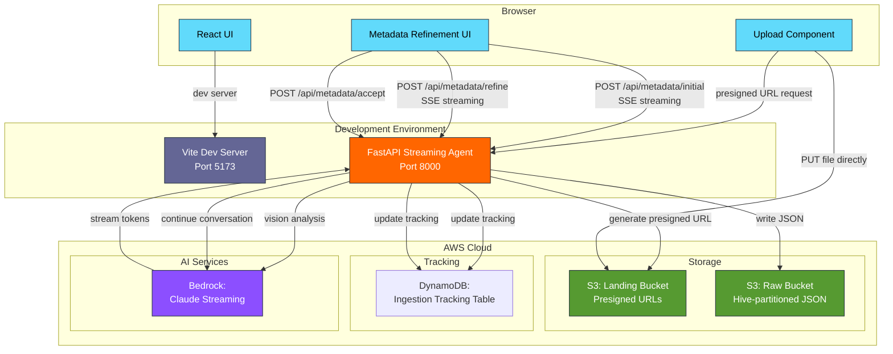

<!-- Improved compatibility of back to top link -->
<a id="readme-top"></a>

<!-- PROJECT SHIELDS -->
[![CI Status][ci-shield]][ci-url]
[![Issues][issues-shield]][issues-url]
[![MIT License][license-shield]][license-url]
[![LinkedIn][linkedin-shield]][linkedin-url]

<!-- PROJECT LOGO -->
<br />
<div align="center">
  <h1>📚</h1>

  <h3 align="center">Bookshelf Demo</h3>

  <p align="center">
    A cloud-native, event-driven ETL pipeline for extracting book metadata from images using AWS Bedrock!
    <br />
    <a href="https://github.com/sudoblark/sudoblark.ai.bookshelf-demo"><strong>Explore the docs »</strong></a>
    <br />
    <br />
    <a href="https://github.com/sudoblark/sudoblark.ai.bookshelf-demo">View Demo</a>
    ·
    <a href="https://github.com/sudoblark/sudoblark.ai.bookshelf-demo/issues/new?labels=bug&template=bug-report---.md">Report Bug</a>
    ·
    <a href="https://github.com/sudoblark/sudoblark.ai.bookshelf-demo/issues/new?labels=enhancement&template=feature-request---.md">Request Feature</a>
  </p>
</div>

<!-- TABLE OF CONTENTS -->
<details>
  <summary>Table of Contents</summary>
  <ol>
    <li>
      <a href="#about-the-project">About The Project</a>
      <ul>
        <li><a href="#repository-structure-mono-repo-vs-micro-repos">Repository Structure: Mono-repo vs Micro-repos</a></li>
        <li><a href="#built-with">Built With</a></li>
      </ul>
    </li>
    <li>
      <a href="#architecture">Architecture</a>
      <ul>
        <li><a href="#data-driven-infrastructure-pattern">Data-Driven Infrastructure Pattern</a></li>
        <li><a href="#etl-pipeline-flow">ETL Pipeline Flow</a></li>
        <li><a href="#metadata-schema">Metadata Schema</a></li>
      </ul>
    </li>
    <li>
      <a href="#getting-started">Getting Started</a>
      <ul>
        <li><a href="#prerequisites">Prerequisites</a></li>
        <li><a href="#installation">Installation</a></li>
      </ul>
    </li>
    <li><a href="#usage">Usage</a></li>
    <li><a href="#testing">Testing</a></li>
    <li><a href="#deployment">Deployment</a></li>
    <li><a href="#troubleshooting">Troubleshooting</a></li>
    <li><a href="#license">License</a></li>
    <li><a href="#contact">Contact</a></li>
    <li><a href="#acknowledgments">Acknowledgments</a></li>
  </ol>
</details>

<!-- ABOUT THE PROJECT -->
## About The Project

> **📢 Workshop Demo Repository**
>
> This project is designed as a **hands-on workshop demonstration** for learning modern AWS serverless patterns and AI integration.
> Whether you're attending a live workshop or exploring on your own, this repo provides a complete, fully-functional example you can deploy and experiment with.

> **⚠️ Infrastructure Configuration**
>
> This repository is pre-configured to deploy to **Sudoblark's AWS infrastructure**. If you want to deploy to your own AWS account, you'll need to modify the Terraform configuration files to match your environment (account names, bucket names, state backend, etc.).

The Bookshelf Demo showcases a complete, full-stack application for extracting book metadata from images using AWS and AI. Upload a book cover via the web interface, refine the extracted metadata through a conversational loop, and save confirmed books to your collection.

**What You'll Learn:**

| Topic | What the demo teaches |
|---|---|
| **Streaming AI Integration** | How to build real-time user experiences with Server-Sent Events, pydantic-ai agent streaming, and stateful conversation sessions |
| **Presigned URLs & Browser Uploads** | Securely uploading files directly from the browser to S3 without routing through your API — reducing latency and costs |
| **Full-Stack Web Development** | React frontend with Vite, FastAPI backend with async handlers, and integrating managed AI services into a seamless UX |
| **Infrastructure as Code** | Data-driven Terraform patterns that keep resource definitions as simple data structures — easy to replicate, extend, or port |
| **Production Engineering** | Type-safe async handlers, comprehensive testing with pytest, CI/CD automation, and modern development workflows |

**Cloud equivalence — the same pattern, different providers:**

| Concept | AWS (this demo) | GCP | Azure |
|---|---|---|---|
| Object storage | S3 | Cloud Storage | Blob Storage |
| Container orchestration | ECS Fargate | Cloud Run | Container Instances |
| API Gateway | API Gateway | Cloud Endpoints | API Management |
| Managed AI model | Bedrock (Claude) | Vertex AI | Azure OpenAI |
| NoSQL database | DynamoDB | Firestore | Cosmos DB |
| IaC | Terraform | Terraform | Terraform |

**Perfect for:** Full-stack developers and cloud architects who want to understand modern AI-powered web applications with streaming interactions, demonstrated end-to-end on AWS.

<p align="right">(<a href="#readme-top">back to top</a>)</p>

### Repository Structure: Mono-repo vs Micro-repos

This repository is a **mono-repo for demo convenience**. In production, each application component would live in its own repository with its own CI pipeline and release cadence — so a hotfix to the API never requires redeploying the ETL pipeline, and a frontend release never blocks on backend changes.

In a micro-repo setup, the repository to functionality mapping would be as follows:

| Production repo | Maps to | Purpose |
|---|---|---|
| `bookshelf.backend.openapi-lambdas` | `modules/data/lambdas.tf` (future) | Static REST endpoints (presigned URLs, accept, bookshelf queries) via Lambda |
| `bookshelf.backend.streaming-container` | `application/backend/streaming-agent/` | Streaming metadata extraction service (ECS Fargate or container) |
| `bookshelf.backend.shared-components` | `application/backend/common/` | Shared utilities (BookshelfTracker, response helpers, etc.) as versioned PyPI package |
| `bookshelf.frontend.portal` | `application/frontend/` | React UI consuming the APIs |

**Note on Terraform:** The infrastructure in `modules/` and `infrastructure/` is intentionally left as a single coupled state in this demo. In production, each service would own its Terraform, but splitting state introduces cross-service references that add complexity without teaching value here.

**Production split rationale:** Static endpoints (presigned URL generation, accept confirmation) stay on Lambda for cost efficiency, whilst streaming metadata extraction requires a persistent container (ECS Fargate). Shared utilities are versioned and imported by both services.

> **💡 Why a mono-repo here?** A single clone, a single `terraform apply`, and a single test run is enough to get the full system running. That removes friction for a demo or workshop while keeping the component boundaries clear enough to reason about the production shape.

<p align="right">(<a href="#readme-top">back to top</a>)</p>

### Built With

* [![Python][Python-badge]][Python-url]
* [![AWS][AWS-badge]][AWS-url]
* [![Terraform][Terraform-badge]][Terraform-url]
* [![GitHub Actions][GitHub-Actions-badge]][GitHub-Actions-url]

<p align="right">(<a href="#readme-top">back to top</a>)</p>


<!-- ARCHITECTURE -->
## Architecture

The system uses a **streaming API architecture** with a React frontend and FastAPI backend:



<p align="right">(<a href="#readme-top">back to top</a>)</p>

### Data-Driven Infrastructure Pattern

This project demonstrates Sudoblark's **three-layer Terraform architecture**:

1. **Data Layer** (`modules/data/`): Infrastructure defined as simple data structures
2. **Infrastructure Modules**: Reusable Terraform modules (referenced from external repositories)
3. **Instantiation Layer** (`infrastructure/aws-sudoblark-development/`): Wires data to modules

**Benefits:**
- Add new resources by updating data structures, not writing Terraform
- Consistent naming and tagging across all resources
- Cross-reference resolution handled automatically
- Easy to test and validate before deployment

<p align="right">(<a href="#readme-top">back to top</a>)</p>

### Application Flow

**Step-by-step interaction:**

1. **Upload**: User selects book cover image in React UI and clicks upload
2. **Presigned URL**: Frontend requests presigned S3 PUT URL from backend
3. **Direct Upload**: Browser uploads file directly to S3 Landing bucket (no API gateway)
4. **Initial Analysis**: Frontend calls `POST /api/metadata/initial` with file location
5. **Streaming Extraction**: Backend streams metadata tokens as SSE (Server-Sent Events) in real-time
6. **User Refinement**: User sees initial metadata and can ask follow-up questions (multi-turn)
7. **Refinement Stream**: Frontend calls `POST /api/metadata/refine` for each question
8. **Accept**: User confirms metadata by clicking "Accept"
9. **Persist**: Backend writes accepted metadata as JSON to Raw bucket with Hive-style partitioning
10. **Track**: Ingestion-tracking table updated with file status throughout

**Processing Time:**
- Presigned URL generation: ~100ms
- Initial metadata extraction (streaming): ~3-8 seconds per image (Bedrock API + streaming overhead)
- Refinement turns: ~1-3 seconds per question
- Accept (S3 write): ~200-500ms

<p align="right">(<a href="#readme-top">back to top</a>)</p>

### API Endpoints

The streaming agent exposes the following HTTP endpoints:

| Endpoint | Method | Purpose | Response |
|---|---|---|---|
| `/health` | GET | Container health check | `{"status": "ok"}` |
| `/api/upload/presigned` | GET | Generate presigned S3 PUT URL | `{"url": "...", "session_id": "..."}` |
| `/api/metadata/initial` | POST | Extract metadata from uploaded image | Server-Sent Events (streaming tokens) |
| `/api/metadata/refine` | POST | Multi-turn refinement conversation | Server-Sent Events (streaming tokens) |
| `/api/metadata/accept` | POST | Save confirmed metadata to S3 | `{"status": "accepted", "saved_key": "...", "upload_id": "..."}` |
| `/ops/files` | GET | List all uploaded files with status | `[{"upload_id": "...", "current_status": "...", ...}]` |
| `/ops/files/{file_id}` | GET | Get details for a single upload | `{"upload_id": "...", "stage_progress": [...], ...}` |

### Metadata Schema

Book metadata is extracted using the pydantic-ai streaming API with Claude as the foundation model. Each accepted record is written to S3 as JSON with Hive-style partitioning (`author={author}/published_year={year}/{uuid}.json`) along with metadata provenance fields (filename, upload_id, extraction timestamp).
## Getting Started

To get a local copy up and running follow these simple steps.

### Prerequisites

**Important Constraints:**
- ⚠️ **AWS Costs**: Running this infrastructure will incur AWS charges (ECS Fargate, S3, DynamoDB, Bedrock API calls). Typical demo: $5-15/day
- 🌍 **Region Lock**: Infrastructure must deploy to `eu-west-2` (London) due to Bedrock model availability
- 🏗️ **Demo Code**: This is workshop/learning code - not production-hardened (no authentication yet, limited error handling)
- 🗑️ **Force Destroy**: All S3 buckets are configured with `force_destroy = true` — running `terraform destroy` will permanently delete all bucket contents without confirmation. This is intentional for a demo environment but should never be used in production.

**Required Tools & Access:**

* **AWS Account** with Bedrock access enabled in eu-west-2
  ```sh
  # Verify AWS CLI configured
  aws sts get-caller-identity
  ```

* **Terraform** 1.6+ (check `.terraform-version` file)
  ```sh
  terraform --version
  ```

* **Python** 3.11+ and **Node.js** 18+
  ```sh
  python --version  # Should be 3.11 or higher
  node --version    # Should be 18.0.0 or higher
  ```

* **Docker** (optional, for running backend via docker-compose)
  ```sh
  docker --version
  ```

* **AWS Bedrock Model Access** - Claude 3.5 Sonnet must be enabled:
  - Model ID: `anthropic.claude-3-5-sonnet-20241022-v2:0`
  - Region: `eu-west-2` (London)
  - Access: Enable in AWS Bedrock console

<p align="right">(<a href="#readme-top">back to top</a>)</p>

### Installation

**Step 1: Clone the repository**

```sh
git clone https://github.com/sudoblark/sudoblark.ai.bookshelf-demo.git
cd sudoblark.ai.bookshelf-demo
```

**Step 2: Set up development environment**

```sh
# Create Python virtual environment
python -m venv .venv
source .venv/bin/activate  # On Windows: .venv\Scripts\activate

# Install development dependencies (all backends + testing)
pip install -r requirements-dev.txt

# Install pre-commit hooks (highly recommended)
pre-commit install

# Install backend dependencies
cd application/backend/streaming-agent
pip install -r requirements.txt
cd ../common
pip install -r requirements.txt
cd ../../..

# Install frontend dependencies
cd application/frontend
npm install
cd ../..
```

> **💡 Pre-commit hooks:** Automatically run code formatters and linters before each commit. This catches issues early before CI/CD.
>
> Run manually: `pre-commit run --all-files`

**Step 3: Deploy infrastructure (AWS resources)**
```sh
cd infrastructure/aws-sudoblark-development
terraform init
terraform plan  # Review changes
terraform apply  # Type 'yes' to confirm
```

**Expected resources created:**
- 2 S3 buckets (landing, raw)
- 1 DynamoDB table (ingestion-tracking)

> **Note:** Terraform currently provisions only storage and tracking. The streaming agent runs locally (docker-compose or uvicorn). ECS Fargate deployment infrastructure is a future enhancement.

<p align="right">(<a href="#readme-top">back to top</a>)</p>

## Local Development

### Running the Backend

The backend is a FastAPI application that can run locally or in a container.

**Option 1: Using Docker Compose (Recommended)**

```sh
cd application/backend/streaming-agent

# Set required environment variables
export AWS_DEFAULT_REGION=eu-west-2
export BEDROCK_MODEL_ID=anthropic.claude-3-5-sonnet-20241022-v2:0
export LANDING_BUCKET=$(aws s3 ls | grep landing | awk '{print $3}')
export RAW_BUCKET=$(aws s3 ls | grep raw | awk '{print $3}')
export TRACKING_TABLE=$(aws dynamodb list-tables --query 'TableNames[?contains(@, `ingestion-tracking`)]' --output text)

# Start the backend on http://localhost:8000
docker-compose up
```

**Option 2: Using uvicorn directly**

```sh
cd application/backend/streaming-agent

# Set environment variables (same as above, plus AWS credentials)
export AWS_ACCESS_KEY_ID=...
export AWS_SECRET_ACCESS_KEY=...

# Start the backend on http://localhost:8000
uvicorn app:app --reload --host 0.0.0.0 --port 8000
```

### Running the Frontend

```sh
cd application/frontend

# Start Vite dev server on http://localhost:5173
npm run dev
```

The frontend is configured to proxy all `/api/*` requests to `http://localhost:8000` (see `vite.config.ts`).

### Required Environment Variables

| Variable | Required | Default | Description |
|---|---|---|---|
| `AWS_DEFAULT_REGION` | Yes | — | AWS region (must be `eu-west-2`) |
| `AWS_ACCESS_KEY_ID` | Yes (if not using IAM role) | — | AWS access key |
| `AWS_SECRET_ACCESS_KEY` | Yes (if not using IAM role) | — | AWS secret key |
| `BEDROCK_MODEL_ID` | Yes | `anthropic.claude-3-5-sonnet-20241022-v2:0` | Bedrock model to use |
| `BEDROCK_REGION` | No | `eu-west-2` | Region for Bedrock API |
| `LANDING_BUCKET` | Yes | — | S3 bucket name for landing zone |
| `RAW_BUCKET` | Yes | — | S3 bucket name for accepted metadata |
| `TRACKING_TABLE` | Yes | — | DynamoDB table name for ingestion tracking |
| `CORS_ALLOWED_ORIGINS` | No | `http://localhost:5173` | Comma-separated list of allowed origins |
| `LOG_LEVEL` | No | `INFO` | Python logging level (`DEBUG`, `INFO`, `WARNING`, `ERROR`) |
| `ISBN_LOOKUP_ENABLED` | No | `true` | Enable ISBN API lookup for book enrichment |

### Quick Start

```sh
# Terminal 1: Start backend
cd application/backend/streaming-agent
docker-compose up  # or uvicorn app:app --reload

# Terminal 2: Start frontend
cd application/frontend
npm run dev

# Open browser to http://localhost:5173
# Upload a book cover image and test the flow
```

### Architecture Notes

- **No authentication** is implemented yet (all endpoints are public) — Cognito integration is on the roadmap
- **Presigned S3 URLs** allow direct browser upload without routing through the API Gateway
- **Server-Sent Events (SSE)** stream metadata extraction tokens in real-time for live UX
- **Stateful sessions** keep conversation history in-process (single container), not persisted across restarts
- **Bedrock streaming** allows token-by-token responses rather than waiting for full completions

<p align="right">(<a href="#readme-top">back to top</a>)</p>

<!-- USAGE EXAMPLES -->
## Usage

### Basic Workflow

The typical user flow through the application:

1. **Start development servers** (see Local Development section above)

2. **Open the UI** - Navigate to http://localhost:5173 in your browser

3. **Upload a book cover**
   - Click "Add your first book"
   - Select a book cover image from your computer (JPG, PNG, etc.)
   - The file is uploaded directly to S3 via presigned URL (no API Gateway)

4. **Watch streaming extraction**
   - The app displays "Extracting..." while tokens stream from Bedrock
   - You see metadata appearing in real-time: title → author → ISBN → description
   - This takes 3-8 seconds depending on image complexity

5. **Refine metadata (optional)**
   - Ask clarifying questions: "Is this a 2024 publication?"
   - Each question streams a refinement response in real-time
   - The UI maintains conversation context

6. **Confirm and save**
   - Click "Save to bookshelf" once metadata is correct
   - Metadata is written to S3 (`s3://raw-bucket/author=X/published_year=Y/uuid.json`)
   - DynamoDB tracking table updates with success status

7. **View operations (debugging)**
   - Click the "Ops" tab in the header (not yet implemented in frontend)
   - Or query directly: `curl http://localhost:8000/ops/files`
   - Lists all uploads with their processing status

<p align="right">(<a href="#readme-top">back to top</a>)</p>

### Testing the API Directly

For development and debugging, you can call the API directly:

**Get presigned URL:**
```sh
curl -s 'http://localhost:8000/api/upload/presigned?filename=cover.jpg' | jq .
```

**Extract metadata (streaming SSE):**
```sh
# After uploading a file to the landing bucket
curl -X POST 'http://localhost:8000/api/metadata/initial' \
  -H 'Content-Type: application/json' \
  -d '{
    "bucket": "aws-sudoblark-development-bookshelf-demo-landing",
    "key": "uploads/demo/test/cover.jpg",
    "filename": "cover.jpg"
  }' | tail -20  # Shows raw SSE events
```

**List all uploads:**
```sh
curl -s 'http://localhost:8000/ops/files' | jq '.[] | {upload_id, current_status, created_at}'
```

**Get single upload details:**
```sh
curl -s 'http://localhost:8000/ops/files/{upload_id}' | jq .
```

<p align="right">(<a href="#readme-top">back to top</a>)</p>

<!-- TESTING -->
## Testing

This project follows Sudoblark's Python quality standards with comprehensive test coverage.

### Running Tests

```sh
# Run all tests with coverage
pytest --cov=application/backend --cov-report=html --cov-report=term-missing

# Run specific test file
pytest tests/test_tracker.py -v

# Run with mocked AWS services
pytest tests/test_file_router.py -v
```

### Test Coverage Requirements

- **Minimum Coverage:** 80%
- **Current Coverage:** Check CI/CD badge at top of README
- **Coverage Report:** Generated in `htmlcov/index.html` after running tests

### Test Structure

```
tests/
├── conftest.py                   # Pytest fixtures and configuration
├── test_common.py                # Tests for shared common utilities
├── test_tracker.py               # Tests for ingestion tracking utility
└── test_ops.py                   # Tests for ops dashboard endpoints (in streaming API)
```

### Linting and Security

```sh
# Format code with Black
black application/backend/ tests/

# Sort imports
isort application/backend/ tests/

# Lint with Flake8
flake8 application/backend/ tests/

# Type checking with mypy (requires boto3-stubs)
pip install 'boto3-stubs[s3,bedrock-runtime]'
mypy application/backend/

# Security scan with Bandit
bandit -r application/backend/
```

**CI/CD:** All checks run automatically on pull requests. See `.github/workflows/pull-request.yaml`.

<p align="right">(<a href="#readme-top">back to top</a>)</p>

<!-- DEPLOYMENT -->
## Deployment

### CI/CD Pipeline

This project uses **GitHub Actions** for continuous integration and deployment:

**Pull Request Workflow** (`.github/workflows/pull-request.yaml`):
- Python linting (Black, isort, Flake8)
- Security scanning (Bandit)
- Unit tests with coverage reporting
- Terraform validation and plan

**Manual Deployment Workflows**:
- `apply.yaml` - Deploy infrastructure to AWS
- `destroy.yaml` - Tear down infrastructure (use with caution)

### Deployment Environments

| Environment | AWS Account | Region | Purpose |
|-------------|-------------|--------|---------|
| Development | sudoblark-development | eu-west-2 | Testing and experimentation |

### Manual Deployment

```sh
# Navigate to infrastructure directory
cd infrastructure/aws-sudoblark-development

# Initialize Terraform (first time only)
terraform init

# Review changes
terraform plan -out=tfplan

# Apply changes
terraform apply tfplan

# Destroy infrastructure (when no longer needed)
terraform destroy
```

### Deployment Verification

```sh
# Verify S3 buckets created
aws s3 ls | grep bookshelf-demo

# Verify Lambda functions deployed
aws lambda list-functions \
  --query 'Functions[?contains(FunctionName, `bookshelf-demo`)].FunctionName'

# Verify Glue resources
aws glue get-database --name aws-sudoblark-development-bookshelf-demo-bookshelf
aws glue get-crawler --name aws-sudoblark-development-bookshelf-demo-bookshelf-crawler

# Test Lambda invocation
aws lambda invoke \
  --function-name aws-sudoblark-development-bookshelf-demo-file-router \
  --payload '{}' \
  response.json
```

<p align="right">(<a href="#readme-top">back to top</a>)</p>

## Current Limitations

This is an **active demo under development**. The following features are coming but not yet implemented:

| Feature | Status | Notes |
|---|---|---|
| **Authentication / Authorization** | 🚫 Not started | All endpoints are public. Cognito integration planned. |
| **Bookshelf Display** | 🚫 Not started | Backend can store accepted books, but no frontend page to list them. |
| **Ook Chat** | 🚧 Stub only | Frontend page exists, backend streaming not implemented. |
| **Embeddings & Similarity** | 🚫 Not started | Can compute book similarity via Bedrock Titan embeddings + cosine similarity. |
| **Persistence across restarts** | ⚠️ Partial | Session state is in-process only; DynamoDB tracking persists. |
| **Error handling** | ⚠️ Basic | Limited error messages and recovery logic (demo code). |
| **Production deployment** | 🚧 In progress | Terraform for ECS Fargate / App Runner not yet implemented. |

**What works:**
- ✅ File upload via presigned URLs
- ✅ Streaming metadata extraction with pydantic-ai
- ✅ Multi-turn conversation refinement
- ✅ Metadata acceptance and S3 storage
- ✅ Ingestion tracking (DynamoDB)
- ✅ Local development (docker-compose or uvicorn)

**Next priority features:**
1. Bookshelf display page (query accepted books from S3/DynamoDB)
2. Ops dashboard UI (visualise ingestion tracking status)
3. Ook chat interface (full streaming chat implementation)
4. Cognito authentication and user scoping
5. Embeddings and similarity search (Bedrock Titan + cosine similarity)
6. Production deployment infrastructure (ECS Fargate + ALB)

<p align="right">(<a href="#readme-top">back to top</a>)</p>

<!-- TROUBLESHOOTING -->
## Troubleshooting

### Common Issues

**Issue: "Bedrock model not accessible"**
```
Error: An error occurred (ResourceNotFoundException) when calling the InvokeModel operation
```
**Solution:** Ensure Claude 3.5 Sonnet is enabled in AWS Bedrock console (eu-west-2 region):
```sh
aws bedrock list-foundation-models --region eu-west-2 --by-provider anthropic
```

**Issue: "Backend won't start - missing environment variables"**
```
KeyError: 'LANDING_BUCKET'
```
**Solution:** Set all required environment variables (see table in Local Development section):
```sh
export LANDING_BUCKET=$(aws s3 ls | grep landing | awk '{print $3}')
export RAW_BUCKET=$(aws s3 ls | grep raw | awk '{print $3}')
export TRACKING_TABLE=$(aws dynamodb list-tables --query 'TableNames[?contains(@, `ingestion-tracking`)]' --output text)
```

**Issue: "CORS error - frontend can't reach backend"**
```
Access to XMLHttpRequest blocked by CORS policy
```
**Solution:**
1. Ensure backend is running on http://localhost:8000
2. Check `CORS_ALLOWED_ORIGINS` env var includes `http://localhost:5173`
3. Verify Vite proxy is configured correctly in `application/frontend/vite.config.ts`

**Issue: "Frontend stuck on 'Extracting...' or times out"**
```
No tokens appearing, UI hangs
```
**Solution:**
1. Check backend logs: `docker-compose logs streaming-agent` (or `uvicorn` output)
2. Verify AWS credentials are set correctly
3. Test Bedrock connectivity: `aws bedrock-runtime invoke-model --model-id anthropic.claude-3-5-sonnet-20241022-v2:0 --body '{"messages":[{"role":"user","content":"test"}]}'`

**Issue: "S3 upload fails - Access Denied"**
```
Error: Access Denied when uploading to presigned URL
```
**Solution:**
1. Verify IAM credentials have S3 access
2. Check presigned URL TTL (should be 5-10 minutes)
3. Ensure URL is for the correct bucket

**Issue: "Terraform state locked"**
```
Error: Error acquiring the state lock
```
**Solution:** Someone else is running Terraform, or previous run didn't complete. Wait or force unlock (dangerous):
```sh
terraform force-unlock LOCK_ID
```

### Debugging Tips

**Check backend health:**
```sh
curl http://localhost:8000/health
```

**Monitor backend logs (docker-compose):**
```sh
cd application/backend/streaming-agent
docker-compose logs -f streaming-agent
```

**Monitor backend logs (uvicorn):**
```sh
# Set LOG_LEVEL=DEBUG for verbose output
export LOG_LEVEL=DEBUG
uvicorn app:app --reload
```

**Inspect saved metadata in S3:**
```sh
RAW_BUCKET=$(aws s3 ls | grep raw | awk '{print $3}')
aws s3 ls s3://${RAW_BUCKET}/ --recursive  # List all saved files
aws s3 cp s3://${RAW_BUCKET}/author=John%20Doe/published_year=2024/uuid.json - | jq .  # View single file
```

**Check DynamoDB tracking table:**
```sh
TRACKING_TABLE=$(aws dynamodb list-tables --query 'TableNames[?contains(@, `ingestion-tracking`)]' --output text)
aws dynamodb scan --table-name ${TRACKING_TABLE} --limit 10 | jq '.Items[]'
```

**Test metadata extraction directly (curl SSE):**
```sh
# Start a metadata extraction and see SSE events in real-time
curl -N -X POST 'http://localhost:8000/api/metadata/initial' \
  -H 'Content-Type: application/json' \
  -d '{
    "bucket": "YOUR_LANDING_BUCKET",
    "key": "path/to/cover.jpg",
    "filename": "cover.jpg"
  }'
```

**Run tests locally:**
```sh
# Activate venv
source .venv/bin/activate

# Run all tests with coverage
pytest --cov=application/backend tests/ -v

# Run specific test file
pytest tests/test_ops.py -v

# Run with detailed output
pytest -vv --tb=short tests/
```

<p align="right">(<a href="#readme-top">back to top</a>)</p>

<!-- LICENSE -->
## License

Distributed under the MIT License. See `LICENSE.txt` for more information.

<p align="right">(<a href="#readme-top">back to top</a>)</p>

<!-- CONTACT -->
## Contact

**Sudoblark Ltd** - Enterprise AI & Cloud Solutions

- 🌐 Website: [sudoblark.com](https://sudoblark.com)
- 💼 LinkedIn: [Sudoblark](https://linkedin.com/company/sudoblark)
- 📧 Email: [hello@sudoblark.com](mailto:hello@sudoblark.com)
- 🐙 GitHub: [@sudoblark](https://github.com/sudoblark)

**Project Link:** [https://github.com/sudoblark/sudoblark.ai.bookshelf-demo](https://github.com/sudoblark/sudoblark.ai.bookshelf-demo)

<p align="right">(<a href="#readme-top">back to top</a>)</p>

<!-- ACKNOWLEDGMENTS -->
## Acknowledgments

This project was built using industry-leading tools and services:

* [AWS Bedrock](https://aws.amazon.com/bedrock/) - Claude 3 Haiku foundation model
* [Terraform](https://www.terraform.io/) - Infrastructure as Code
* [GitHub Actions](https://github.com/features/actions) - CI/CD automation
* [pytest](https://pytest.org/) - Python testing framework
* [Best-README-Template](https://github.com/othneildrew/Best-README-Template) - README structure
* [Shields.io](https://shields.io/) - README badges

**Architecture Patterns:**
This project demonstrates Sudoblark's professional development practices including data-driven infrastructure patterns, comprehensive testing, and modern DevOps workflows.

<p align="right">(<a href="#readme-top">back to top</a>)</p>

<!-- MARKDOWN LINKS & IMAGES -->
[contributors-shield]: https://img.shields.io/github/contributors/sudoblark/sudoblark.ai.bookshelf-demo.svg?style=for-the-badge
[contributors-url]: https://github.com/sudoblark/sudoblark.ai.bookshelf-demo/graphs/contributors
[forks-shield]: https://img.shields.io/github/forks/sudoblark/sudoblark.ai.bookshelf-demo.svg?style=for-the-badge
[forks-url]: https://github.com/sudoblark/sudoblark.ai.bookshelf-demo/network/members
[stars-shield]: https://img.shields.io/github/stars/sudoblark/sudoblark.ai.bookshelf-demo.svg?style=for-the-badge
[stars-url]: https://github.com/sudoblark/sudoblark.ai.bookshelf-demo/stargazers
[issues-shield]: https://img.shields.io/github/issues/sudoblark/sudoblark.ai.bookshelf-demo.svg?style=for-the-badge
[issues-url]: https://github.com/sudoblark/sudoblark.ai.bookshelf-demo/issues
[license-shield]: https://img.shields.io/github/license/sudoblark/sudoblark.ai.bookshelf-demo.svg?style=for-the-badge
[license-url]: https://github.com/sudoblark/sudoblark.ai.bookshelf-demo/blob/main/LICENSE.txt
[linkedin-shield]: https://img.shields.io/badge/-LinkedIn-black.svg?style=for-the-badge&logo=linkedin&colorB=555
[linkedin-url]: https://linkedin.com/company/sudoblark
[product-screenshot]: images/screenshot.png

<!-- Technology Badges -->
[Python-badge]: https://img.shields.io/badge/Python-3776AB?style=for-the-badge&logo=python&logoColor=white
[Python-url]: https://www.python.org/
[AWS-badge]: https://img.shields.io/badge/AWS-232F3E?style=for-the-badge&logo=amazon-aws&logoColor=white
[AWS-url]: https://aws.amazon.com/
[Terraform-badge]: https://img.shields.io/badge/Terraform-7B42BC?style=for-the-badge&logo=terraform&logoColor=white
[Terraform-url]: https://www.terraform.io/
[GitHub-Actions-badge]: https://img.shields.io/badge/GitHub_Actions-2088FF?style=for-the-badge&logo=github-actions&logoColor=white
[GitHub-Actions-url]: https://github.com/features/actions
[Bedrock-badge]: https://img.shields.io/badge/AWS_Bedrock-FF9900?style=for-the-badge&logo=amazon-aws&logoColor=white
[Bedrock-url]: https://aws.amazon.com/bedrock/
[Lambda-badge]: https://img.shields.io/badge/AWS_Lambda-FF9900?style=for-the-badge&logo=aws-lambda&logoColor=white
[Lambda-url]: https://aws.amazon.com/lambda/
[S3-badge]: https://img.shields.io/badge/AWS_S3-569A31?style=for-the-badge&logo=amazon-s3&logoColor=white
[S3-url]: https://aws.amazon.com/s3/
[Athena-badge]: https://img.shields.io/badge/AWS_Athena-232F3E?style=for-the-badge&logo=amazon-aws&logoColor=white
[Athena-url]: https://aws.amazon.com/athena/
[Glue-badge]: https://img.shields.io/badge/AWS_Glue-FF9900?style=for-the-badge&logo=amazon-aws&logoColor=white
[Glue-url]: https://aws.amazon.com/glue/
[ci-shield]: https://github.com/sudoblark/sudoblark.ai.bookshelf-demo/actions/workflows/pull-request.yaml/badge.svg?style=for-the-badge
[ci-url]: https://github.com/sudoblark/sudoblark.ai.bookshelf-demo/actions/workflows/pull-request.yaml
