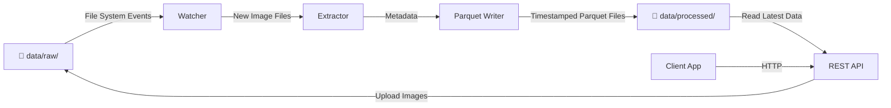
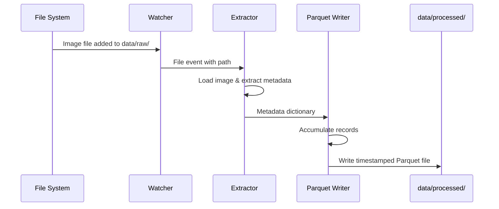
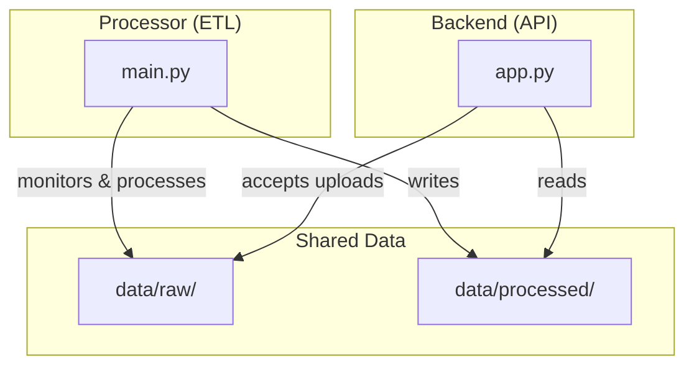

# Architecture

This document describes the design of the Bookshelf Demo ETL pipeline, the role of each component, and how the system works end-to-end.

## System Overview

The Bookshelf Demo is a fully local, event-driven ETL pipeline that processes book cover images and extracts metadata into structured Parquet files. The system includes both a backend processor and an optional REST API for file upload and data retrieval.

### High-Level Data Flow



## Architecture Overview

The system consists of two main components:

- **Processor** (`processor/`): Local, event-driven ETL pipeline that monitors `data/raw/`, extracts metadata, and writes timestamped Parquet files to `data/processed/`
- **Backend** (`backend/`): Optional Flask REST API for uploading images and retrieving processed data via HTTP

## Data Flow Diagram



## API Endpoints (Backend)

When running with the backend:

- `POST /upload` - Upload image files to `data/raw/`
- `GET /books` - Retrieve processed metadata as JSON
- `GET /status` - System status (pending images, processed records)
- `GET /health` - Health check
- `GET /config` - Configuration info (debug mode only)

## Integration Between Processor and Backend

When using the REST API with the processor:

1. **Client** calls `POST /upload` with an image file
2. **Backend** saves the image to `data/raw/`
3. **Processor** detects the new file via watcher
4. **Processor** extracts metadata and writes Parquet output
5. **Client** calls `GET /books` to retrieve the processed metadata
6. **Backend** reads the latest Parquet file and returns JSON response

## Component Interactions



## Directory Structure

```
sudoblark.ai.bookshelf-demo/
├── processor/              # Core ETL pipeline
│   ├── main.py            # Entry point & orchestration
│   ├── watcher.py         # Filesystem monitoring
│   ├── extractor.py       # Metadata extraction
│   ├── parquet_writer.py  # Parquet output generation
│   ├── logger.py          # Centralized logging
│   ├── utils.py           # Shared utilities (future)
│   └── requirements.txt    # Python dependencies
├── backend/               # Optional REST API
│   ├── app.py            # Flask app initialization
│   ├── routes.py         # HTTP endpoints
│   ├── parquet_reader.py # Parquet file reading
│   ├── settings.py       # Configuration
│   ├── utils.py          # Helper functions
│   └── requirements.txt   # Flask dependencies
├── data/
│   ├── raw/              # Input directory for book cover images
│   └── processed/        # Output directory for Parquet files
├── docs/                 # Documentation
│   └── architecture.md   # This file
└── README.md             # Project overview
```

## Design Principles

### 1. Single Responsibility
Each module has a clear, focused purpose:
- Watcher: Listen for files
- Extractor: Extract metadata
- Parquet Writer: Persist data

### 2. Local-First Architecture
- No cloud storage dependencies
- No external API calls required (by default)
- All processing happens on the local machine
- Suitable for offline environments

### 3. Event-Driven Processing
- Files are processed as they arrive
- No polling or batch schedules
- Responsive to filesystem changes

### 4. Extensibility
- Integration points for future Copilot Studio enhancements
- Placeholder implementations can be replaced with real logic
- Comments mark future API integration points

### 5. Explicit Over Implicit
- Paths are explicit and validated
- No magic values or hardcoded assumptions
- Configuration is clear and traceable

## Error Handling & Resilience

- **File Errors:** Gracefully skip files that cannot be read
- **Extraction Failures:** Log errors and continue processing
- **Parquet Write Errors:** Alert user and retain data for retry
- **Duplicate Files:** Debounce rapid file changes to prevent duplicate processing

## Future Enhancements

1. **Copilot Integration:** Replace placeholder metadata extraction with Copilot Studio agent calls
2. **Configuration Management:** YAML/JSON config file for paths and behavior
3. **Logging & Monitoring:** Structured logging for debugging and monitoring
4. **Batch Processing:** Support for batch import of existing images
5. **Data Validation:** Schema validation for extracted metadata
6. **Performance Optimization:** Parallel processing for large image batches

## Running the System

### Using the Makefile (Recommended)

The Makefile automates setup and running. Open two terminal windows:

**Terminal 1 - Processor:**
```bash
make install-processor
make run-processor
```

**Terminal 2 - Backend:**
```bash
make install-backend
make run-backend
```

Arrange terminals side-by-side to monitor both processes simultaneously.

### Manual Setup

**Processor Only:**

```bash
cd processor
python3 -m venv venv
source venv/bin/activate
pip install -r requirements.txt
python main.py
```

**With REST API:**

In one terminal, start the processor:

```bash
cd processor
source venv/bin/activate
python main.py
```

In another terminal, start the backend:

```bash
cd backend
source venv/bin/activate
python app.py
```

Then use the API:

```bash
# Upload an image
curl -X POST -F "file=@/path/to/cover.jpg" http://localhost:5000/upload

# Get processed books
curl http://localhost:5000/books

# Check system status
curl http://localhost:5000/status
```

The system will:
1. Accept image uploads via REST API (if backend is running)
4. Continue running until manually stopped (Ctrl+C)
