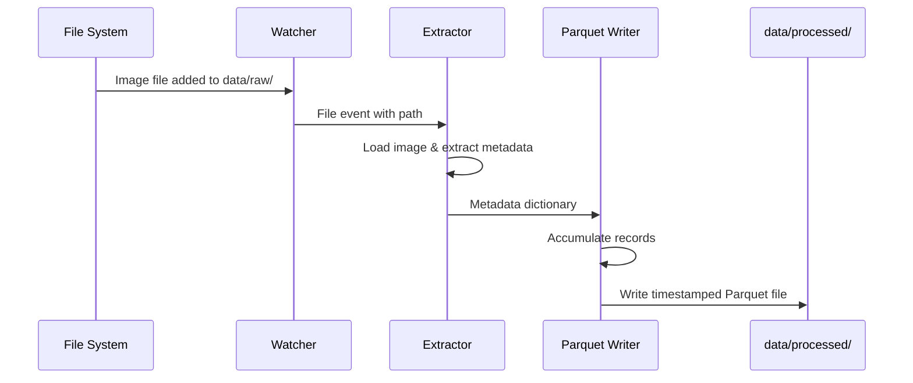
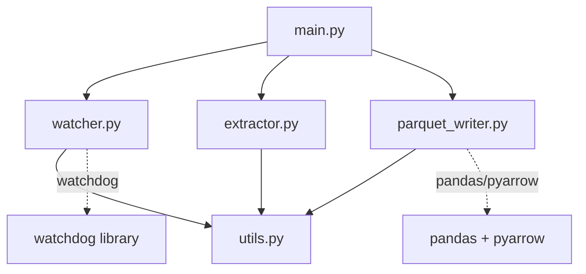

# Architecture

This document describes the design of the Bookshelf Demo ETL pipeline, the role of each component, and how the system works end-to-end.

## System Overview

The Bookshelf Demo is a fully local, event-driven ETL pipeline that processes book cover images and extracts metadata into structured Parquet files. The system is designed for simplicity and local execution with no external cloud dependencies.

### High-Level Data Flow


## Architecture Components

### 1. Watcher (`processor/watcher.py`)

**Purpose:** Monitor the filesystem for new image files in real-time.

**Responsibilities:**
- Watch the `data/raw/` directory for new, modified, and deleted files
- Filter for image file extensions (PNG, JPG, JPEG, WEBP)
- Emit file system events to the processing pipeline
- Handle edge cases (file locks, rapid changes, duplicate events)

**Technology:** Watchdog library for cross-platform filesystem monitoring

**Key Concepts:**
- Event-driven architecture—processes files as they arrive
- Debouncing to prevent duplicate processing
- Explicit path handling (no hardcoded paths)

### 2. Extractor (`processor/extractor.py`)

**Purpose:** Extract metadata from book cover images.

**Responsibilities:**
- Load image files from `data/raw/`
- Extract book-related metadata (title, author, ISBN, etc.)
- Return structured metadata as dictionaries or dataframes
- Handle extraction failures gracefully

**Placeholder Implementation:**
The current implementation returns placeholder metadata. Integration with a Copilot Studio agent for advanced extraction is left as an integration point.

**Example Placeholder Metadata:**
```python
{
    "filename": "cover.jpg",
    "title": "Extracted Title",
    "author": "Extracted Author",
    "isbn": "Extracted ISBN",
    "processed_at": "2026-01-26T12:34:56Z"
}
```

**Future Integration:** Comments in the code indicate where a Copilot API call will be inserted for intelligent metadata extraction.

### 3. Parquet Writer (`processor/parquet_writer.py`)

**Purpose:** Write extracted metadata into timestamped Parquet files.

**Responsibilities:**
- Accumulate metadata records
- Convert records to pandas DataFrames
- Write DataFrames to Parquet format using PyArrow
- Generate timestamped filenames for output files
- Organize output in `data/processed/`

**File Naming Convention:**
```
output_YYYYMMDD_HHMMSS.parquet
```

**Benefits of Parquet Format:**
- Efficient columnar storage
- Native support for nested data structures
- Compression (smaller file sizes)
- Fast querying and analysis with pandas/PyArrow

### 4. Main Orchestrator (`processor/main.py`)

**Purpose:** Orchestrate the entire ETL pipeline.

**Responsibilities:**
- Initialize the Watcher, Extractor, and Parquet Writer
- Coordinate data flow between components
- Handle errors and logging
- Provide a clean entry point for the application

**Execution Model:**
- Starts with `python main.py`
- Runs indefinitely, watching for new files
- Processes files as they arrive

### 5. Utilities (`processor/utils.py`)

**Purpose:** Provide shared utility functions.

**Responsibilities:**
- Path resolution and validation
- File format validation
- Common helper functions
- Configuration constants

## Data Flow Diagram



## Module Dependencies



## Directory Structure

```
processor/
├── main.py              # Entry point & orchestration
├── watcher.py           # Filesystem monitoring
├── extractor.py         # Metadata extraction
├── parquet_writer.py    # Parquet output generation
├── utils.py             # Shared utilities
└── requirements.txt     # Python dependencies

data/
├── raw/                 # Input images (monitored)
└── processed/           # Output Parquet files (generated)
```

## Design Principles

### 1. Single Responsibility
Each module has a clear, focused purpose:
- Watcher: Listen for files
- Extractor: Extract metadata
- Parquet Writer: Persist data

### 2. Local-First Architecture
- No cloud storage dependencies
- No external API calls required (by default)
- All processing happens on the local machine
- Suitable for offline environments

### 3. Event-Driven Processing
- Files are processed as they arrive
- No polling or batch schedules
- Responsive to filesystem changes

### 4. Extensibility
- Integration points for future Copilot Studio enhancements
- Placeholder implementations can be replaced with real logic
- Comments mark future API integration points

### 5. Explicit Over Implicit
- Paths are explicit and validated
- No magic values or hardcoded assumptions
- Configuration is clear and traceable

## Error Handling & Resilience

- **File Errors:** Gracefully skip files that cannot be read
- **Extraction Failures:** Log errors and continue processing
- **Parquet Write Errors:** Alert user and retain data for retry
- **Duplicate Files:** Debounce rapid file changes to prevent duplicate processing

## Future Enhancements

1. **Copilot Integration:** Replace placeholder metadata extraction with Copilot Studio agent calls
2. **Configuration Management:** YAML/JSON config file for paths and behavior
3. **Logging & Monitoring:** Structured logging for debugging and monitoring
4. **Batch Processing:** Support for batch import of existing images
5. **Data Validation:** Schema validation for extracted metadata
6. **Performance Optimization:** Parallel processing for large image batches

## Running the System

```bash
cd processor
pip install -r requirements.txt
python main.py
```

The system will:
1. Start monitoring `data/raw/` for new image files
2. Automatically process files as they arrive
3. Generate Parquet files in `data/processed/`
4. Continue running until manually stopped (Ctrl+C)
