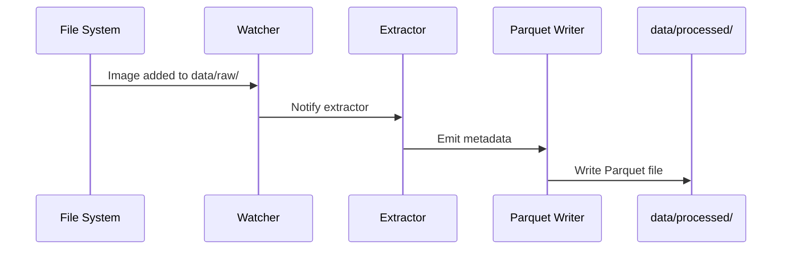
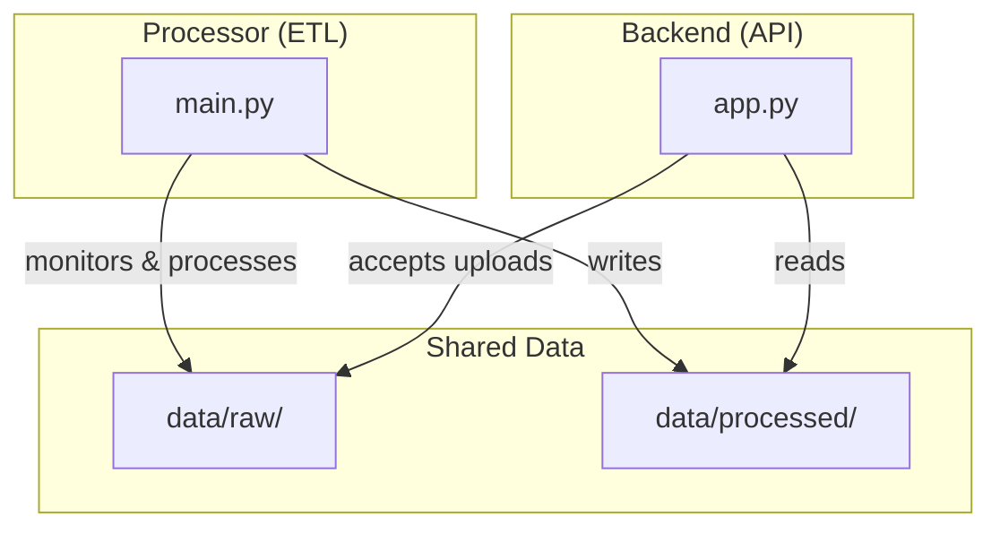

# Architecture

This document describes the design of the Bookshelf Demo ETL pipeline and the role of each component.

## System Overview

The Bookshelf Demo is a fully local, event-driven ETL pipeline that processes book cover images and extracts metadata into structured Parquet files. The system consists of a processor (ETL), an optional Flask backend (REST API), and an optional Flutter client used for demos.

### High-Level Data Flow


## Sequence (file lifecycle)



## API Endpoints (Backend)

When running the backend, the API exposes:

- `POST /upload` - Upload image files
- `GET /books` - Retrieve processed metadata as JSON
- `GET /status` - System status (pending images, processed records)
- `GET /health` - Health check

## Integration Between Processor and Backend

Typical flow when using the REST API:

1. Client calls `POST /upload` with an image file.
2. Backend saves the image to `data/raw/`.
3. Processor detects the new file via the watcher.
4. Processor extracts metadata and writes Parquet output to `data/processed/`.
5. Client calls `GET /books` to retrieve the processed metadata; backend reads Parquet and returns JSON.

## Component Interactions



## Directory Structure

```
sudoblark.ai.bookshelf-demo/
├── processor/              # Core ETL pipeline
├── backend/               # REST API
├── user_interface/        # Flutter client (UI)
├── data/
│   ├── raw/              # Input directory for book cover images
│   └── processed/        # Output Parquet files
└── docs/                  # Documentation and runbooks
```

For run instructions and the facilitator checklist, see: `docs/demo-setup.md`.
