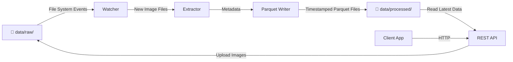
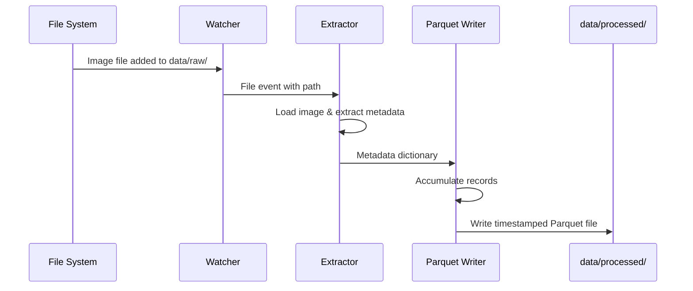
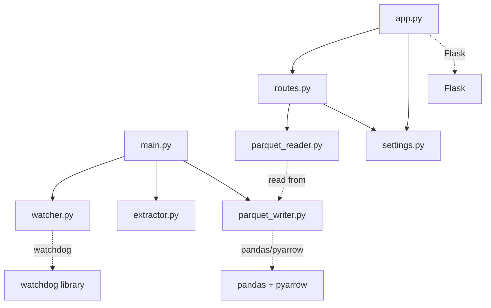

# Architecture

This document describes the design of the Bookshelf Demo ETL pipeline, the role of each component, and how the system works end-to-end.

## System Overview

The Bookshelf Demo is a fully local, event-driven ETL pipeline that processes book cover images and extracts metadata into structured Parquet files. The system includes both a backend processor and an optional REST API for file upload and data retrieval.

### High-Level Data Flow



### Architecture Components

The system consists of two main components: the **Processor** (local ETL pipeline) and the **Backend** (optional REST API interface).

## Processor Components

The processor folder contains the core ETL pipeline modules:

### 1. Watcher (`processor/watcher.py`)

**Purpose:** Monitor the filesystem for new image files in real-time.

**Responsibilities:**
- Watch the `data/raw/` directory for new, modified, and deleted files
- Filter for image file extensions (PNG, JPG, JPEG, WEBP)
- Emit file system events to the processing pipeline
- Handle edge cases (file locks, rapid changes, duplicate events)

**Technology:** Watchdog library for cross-platform filesystem monitoring

**Key Concepts:**
- Event-driven architecture—processes files as they arrive
- Debouncing to prevent duplicate processing
- Explicit path handling (no hardcoded paths)

### 2. Extractor (`processor/extractor.py`)

**Purpose:** Extract metadata from book cover images.

**Responsibilities:**
- Load image files from `data/raw/`
- Extract book-related metadata (title, author, ISBN, etc.)
- Return structured metadata as dictionaries or dataframes
- Handle extraction failures gracefully

**Placeholder Implementation:**
The current implementation returns placeholder metadata. Integration with a Copilot Studio agent for advanced extraction is left as an integration point.

**Example Placeholder Metadata:**
```python
{
    "filename": "cover.jpg",
    "title": "Extracted Title",
    "author": "Extracted Author",
    "isbn": "Extracted ISBN",
    "processed_at": "2026-01-26T12:34:56Z"
}
```

**Future Integration:** Comments in the code indicate where a Copilot API call will be inserted for intelligent metadata extraction.

### 3. Parquet Writer (`processor/parquet_writer.py`)

**Purpose:** Write extracted metadata into timestamped Parquet files.

**Responsibilities:**
- Accumulate metadata records
- Convert records to pandas DataFrames
- Write DataFrames to Parquet format using PyArrow
- Generate timestamped filenames for output files
- Organize output in `data/processed/`

**File Naming Convention:**
```
output_YYYYMMDD_HHMMSS.parquet
```

**Benefits of Parquet Format:**
- Efficient columnar storage
- Native support for nested data structures
- Compression (smaller file sizes)
- Fast querying and analysis with pandas/PyArrow

### 4. Main Orchestrator (`processor/main.py`)

**Purpose:** Orchestrate the entire ETL pipeline.

**Responsibilities:**
- Initialize the Watcher, Extractor, and Parquet Writer
- Coordinate data flow between components
- Handle errors and logging
- Provide a clean entry point for the application

**Execution Model:**
- Starts with `python main.py`
- Runs indefinitely, watching for new files
- Processes files as they arrive

### 5. Utilities (`processor/utils.py`)

**Purpose:** Provide shared utility functions.

**Responsibilities:**
- Path resolution and validation
- File format validation
- Common helper functions
- Configuration constants

## Data Flow Diagram



## Backend Components (Optional REST API)

The backend folder provides a Flask-based REST API for uploading images and retrieving processed data:

### 1. Flask Application (`backend/app.py`)

**Purpose:** Initialize and configure the Flask web server.

**Responsibilities:**
- Create Flask app instance
- Load configuration from `settings.py`
- Register routes and blueprints
- Provide runnable entrypoint

**Technology:** Flask micro-framework for lightweight HTTP server

**Key Concepts:**
- Minimal setup focused on app configuration
- Local-only demo (no authentication, no database, no cloud)
- Routes delegated to `routes.py`

### 2. REST Routes (`backend/routes.py`)

**Purpose:** Implement HTTP endpoints for file upload and data retrieval.

**Endpoints:**

- **POST /upload**
  - Accept multipart/form-data with a single file field named "file"
  - Save the file to `data/raw/` with a safe filename
  - Validate allowed extensions (jpg, jpeg, png, webp)
  - Return JSON response with status and saved file path
  - The processor watcher automatically detects and processes the uploaded image

- **GET /books**
  - Read the newest Parquet file from `data/processed/` via `parquet_reader.py`
  - Return JSON array of book records
  - Return empty array with helpful message if no data yet processed

**Key Concepts:**
- Thin endpoints focused on I/O only
- No direct extraction triggering (processor handles it asynchronously)
- Clear HTTP status codes and JSON error messages
- Demo-friendly and readable design

### 3. Parquet Reader (`backend/parquet_reader.py`)

**Purpose:** Read and parse Parquet files into JSON-serializable format.

**Responsibilities:**
- Locate the newest Parquet file in `data/processed/`
- Read Parquet file using PyArrow/pandas
- Convert records to JSON-serializable dictionaries
- Handle missing or corrupted files gracefully

**Technology:** PyArrow and pandas for Parquet file handling

### 4. Settings (`backend/settings.py`)

**Purpose:** Centralized configuration management.

**Responsibilities:**
- Define paths to data directories
- Set allowed file extensions
- Configure Flask server parameters
- Environment-specific settings

**Key Concepts:**
- All paths are derived from project structure
- Settings are imported and used by app.py and routes.py

### 5. Utilities (`backend/utils.py`)

**Purpose:** Helper functions for file operations and validation.

**Responsibilities:**
- Safe filename generation and validation
- File extension validation
- Directory and file existence checks
- Common utilities used by routes and readers

## Integration Between Processor and Backend

When using the REST API with the processor:

1. **Client** calls `POST /upload` with an image file
2. **Backend** saves the image to `data/raw/`
3. **Processor** detects the new file via watcher
4. **Processor** extracts metadata and writes Parquet output
5. **Client** calls `GET /books` to retrieve the processed metadata
6. **Backend** reads the latest Parquet file and returns JSON response

## Module Dependencies



## Directory Structure

```
sudoblark.ai.bookshelf-demo/
├── processor/              # Core ETL pipeline
│   ├── main.py            # Entry point & orchestration
│   ├── watcher.py         # Filesystem monitoring
│   ├── extractor.py       # Metadata extraction
│   ├── parquet_writer.py  # Parquet output generation
│   ├── logger.py          # Centralized logging
│   ├── utils.py           # Shared utilities (future)
│   └── requirements.txt    # Python dependencies
├── backend/               # Optional REST API
│   ├── app.py            # Flask app initialization
│   ├── routes.py         # HTTP endpoints
│   ├── parquet_reader.py # Parquet file reading
│   ├── settings.py       # Configuration
│   ├── utils.py          # Helper functions
│   └── requirements.txt   # Flask dependencies
├── data/
│   ├── raw/              # Input directory for book cover images
│   └── processed/        # Output directory for Parquet files
├── docs/                 # Documentation
│   └── architecture.md   # This file
└── README.md             # Project overview
```

## Design Principles

### 1. Single Responsibility
Each module has a clear, focused purpose:
- Watcher: Listen for files
- Extractor: Extract metadata
- Parquet Writer: Persist data

### 2. Local-First Architecture
- No cloud storage dependencies
- No external API calls required (by default)
- All processing happens on the local machine
- Suitable for offline environments

### 3. Event-Driven Processing
- Files are processed as they arrive
- No polling or batch schedules
- Responsive to filesystem changes

### 4. Extensibility
- Integration points for future Copilot Studio enhancements
- Placeholder implementations can be replaced with real logic
- Comments mark future API integration points

### 5. Explicit Over Implicit
- Paths are explicit and validated
- No magic values or hardcoded assumptions
- Configuration is clear and traceable

## Error Handling & Resilience

- **File Errors:** Gracefully skip files that cannot be read
- **Extraction Failures:** Log errors and continue processing
- **Parquet Write Errors:** Alert user and retain data for retry
- **Duplicate Files:** Debounce rapid file changes to prevent duplicate processing

## Future Enhancements

1. **Copilot Integration:** Replace placeholder metadata extraction with Copilot Studio agent calls
2. **Configuration Management:** YAML/JSON config file for paths and behavior
3. **Logging & Monitoring:** Structured logging for debugging and monitoring
4. **Batch Processing:** Support for batch import of existing images
5. **Data Validation:** Schema validation for extracted metadata
6. **Performance Optimization:** Parallel processing for large image batches

## Running the System

### Processor Only

```bash
cd processor
python3 -m venv venv
source venv/bin/activate
pip install -r requirements.txt
python main.py
```

The processor will monitor `data/raw/` and generate Parquet files in `data/processed/`.

### With REST API

In one terminal, start the processor:

```bash
cd processor
source venv/bin/activate
python main.py
```

In another terminal, start the backend:

```bash
cd backend
python3 -m venv venv
source venv/bin/activate
pip install -r requirements.txt
python app.py
```

Then use the API:

```bash
# Upload an image
curl -X POST -F "file=@/path/to/cover.jpg" http://localhost:5000/upload

# Get processed books
curl http://localhost:5000/books
```

The system will:
1. Accept image uploads via REST API
2. Automatically process files via the processor
3. Return processed metadata via REST API
4. Continue running until manually stopped (Ctrl+C)
